Abstract

Este relatório apresenta os resultados do Experimento 01, que tem como
objetivo explorar ferramentas de análise e monitoramento de redes em
ambiente emulado utilizando o Mininet. São abordados comandos essenciais
e suas funcionalidades, com destaque para o uso do Wireshark, Iperf e
Tcpdump, bem como os comandos internos do Mininet. Resultados são
apresentados por meio de capturas de tela e análises descritivas.

# 1 Introdução

Neste trabalho é demonstrado o uso das ferramentas e comandos
solicitados no documento do experimento. O foco é compreender como tais
ferramentas podem ser utilizadas para inspeção, monitoramento e análise
de redes em um ambiente SDN.

# 2 Wireshark

O Wireshark é um analisador de pacotes de rede. Ele permite capturar,
inspecionar e interpretar pacotes em tempo real ou previamente gravados.

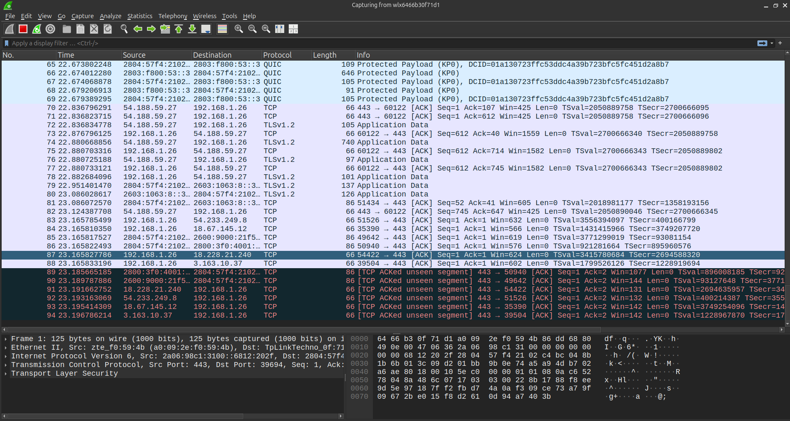{width="5.25in"
height="2.8018274278215225in"}

Exemplo de captura no Wireshark

# 3 Mininet e Comandos Básicos

## 3.1 Chamando o `mn -h`

O comando `sudo mn -h` exibe as opções de inicialização do Mininet.

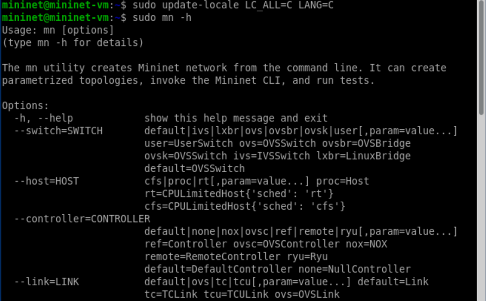{width="5.25in"
height="3.25457239720035in"}

Execução do comando `sudo mn -h`

## 3.2 Ambiente emulado

O comando `sudo mn` inicializa o ambiente de rede emulado.

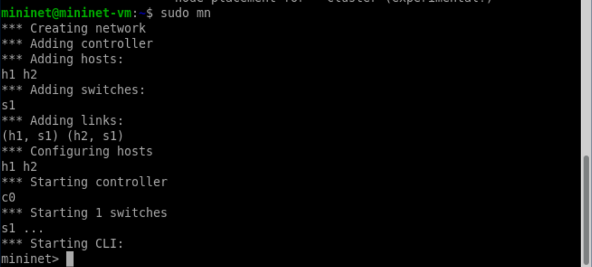{width="5.25in"
height="2.3683803587051617in"}

Inicialização do ambiente Mininet

## 3.3 Help Interno

O comando `help`, digitado dentro do Mininet, lista instruções para
gerenciar a rede. Os principais são `nodes`, `net` e `dump`.

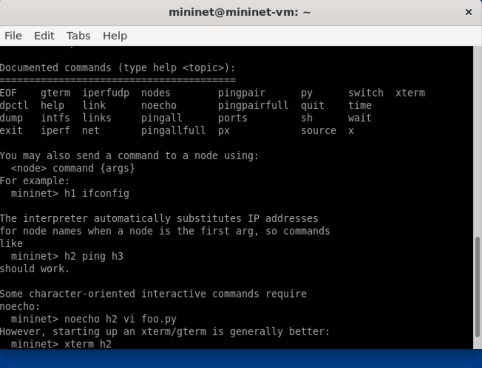{width="5.25in"
height="4.009968285214348in"}

Lista de comandos disponíveis no Mininet

## 3.4 Nodes

O comando `nodes` lista os dispositivos da rede em execução.

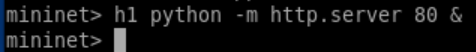{width="5.25in"
height="0.5735290901137358in"}

Saída do comando `nodes`

## 3.5 Net

O comando `net` mostra a topologia da rede, incluindo hosts, switches e
conexões.

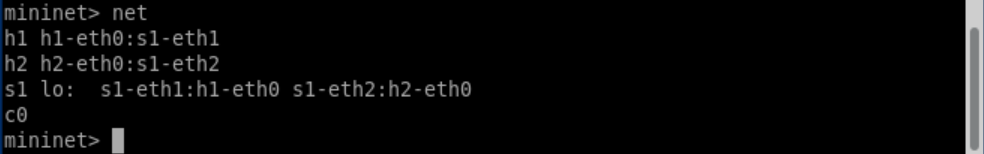{width="5.25in"
height="0.8216458880139983in"}

Topologia exibida pelo comando `net`

## 3.6 Dump

O comando `dump` exibe o status dos dispositivos presentes na rede.

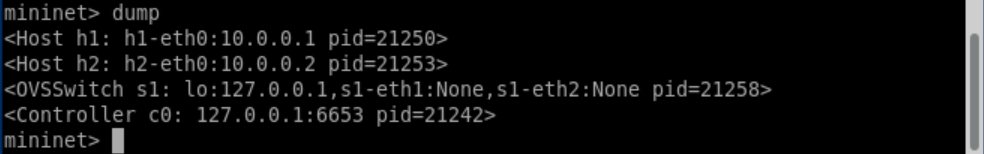{width="5.25in"
height="0.8216458880139983in"}

Saída do comando `dump`

# 4 Verificação da Rede Emulada

## 4.1 h1 ifconfig -a

O comando `h1 ifconfig -a` exibe as interfaces de rede disponíveis no
host `h1`.

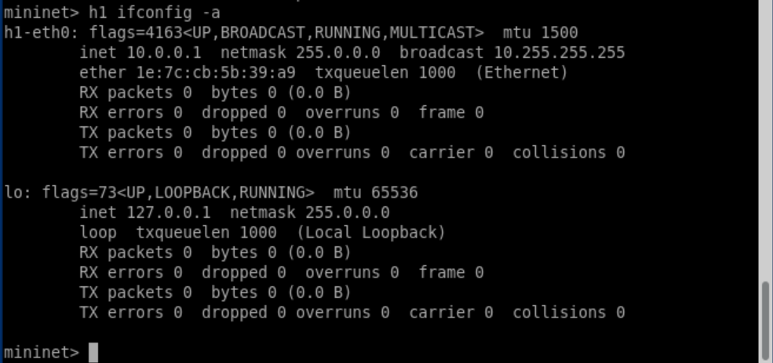{width="5.25in"
height="2.467765748031496in"}

Execução do comando `h1 ifconfig -a`

## 4.2 s1 ifconfig -a

O comando `s1 ifconfig -a` mostra as interfaces do switch `s1`.

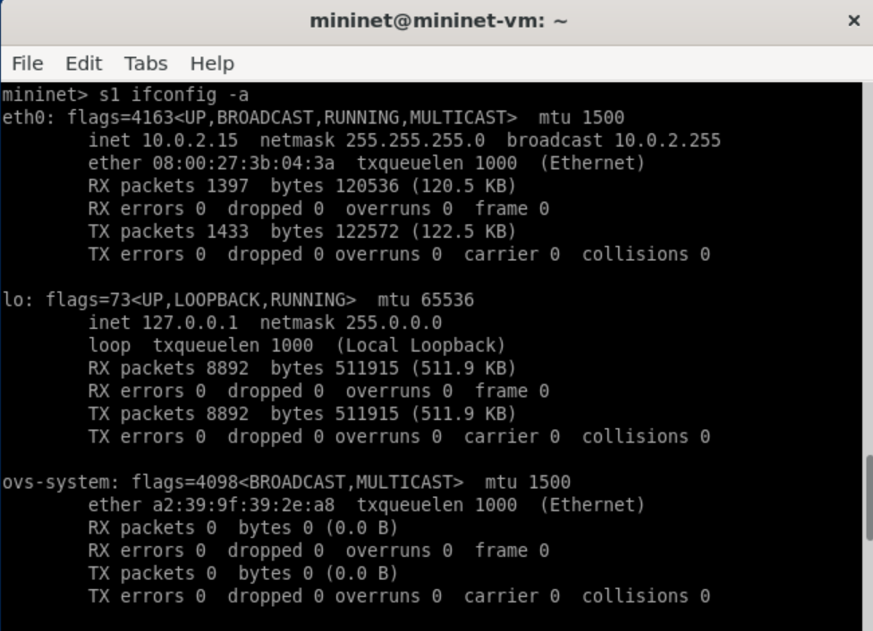{width="5.25in"
height="3.7976432633420822in"}

Execução do comando `s1 ifconfig -a`

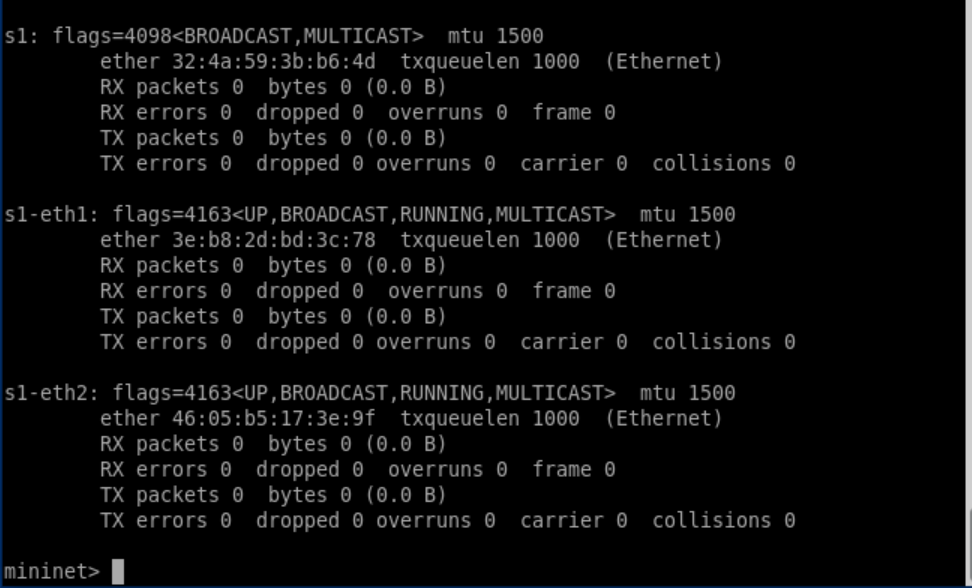{width="5.25in"
height="3.1759251968503937in"}

Execução adicional do comando `s1 ifconfig -a`

## 4.3 Processos em execução

O comando `ps -a` lista os processos ativos no host emulado.

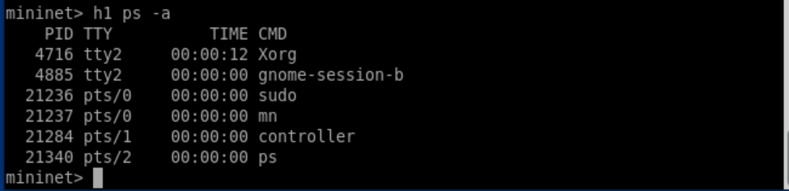{width="5.25in"
height="1.2761537620297463in"}

Execução do comando `ps -a`

# 5 Verificação do acesso entre os hosts

## 5.1 h1 ping -c 10 h2

O comando `h1 ping -c 10 h2` executa um teste de conectividade enviando
10 pacotes ICMP do host `h1` para o host `h2`.

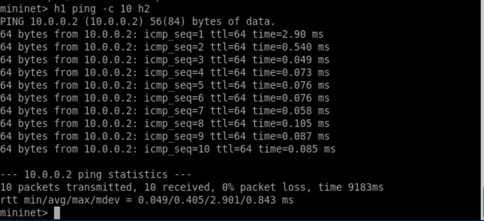{width="5.25in"
height="2.3972101924759404in"}

Execução do comando `h1 ping -c 10 h2`

## 5.2 pingall

O comando `pingall` testa a conectividade entre todos os nós da
topologia.

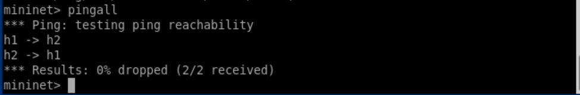{width="5.25in"
height="0.8678127734033246in"}

Execução do comando `pingall`

# 6 Criando fluxo

## 6.1 h1 python -m http.server 80 &

O comando `h1 python -m http.server 80 &` inicia um servidor web HTTP no
host `h1` na porta 80 em segundo plano.

{width="5.25in"
height="0.5735290901137358in"}

Execução do comando `h1 python -m http.server 80 &`

## 6.2 h2 wget -O - http://h1

O comando `h2 wget -O - http://h1` é usado para baixar o conteúdo do
servidor web do host `h1` a partir do host `h2` e exibir na tela.

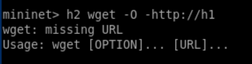{width="5.25in"
height="1.3401629483814523in"}

Execução do comando `h2 wget -O - http://h1`

## 6.3 h1 kill %python

O comando `h1 kill %python` é usado para parar o processo Python que
está rodando em segundo plano no host `h1`.

{width="5.25in"
height="0.7305424321959755in"}

Execução do comando `h1 kill %python`

# 7 Saindo do Mininet

## 7.1 exit

O comando `exit` é usado para sair do ambiente Mininet e encerrar toda a
topologia de rede.

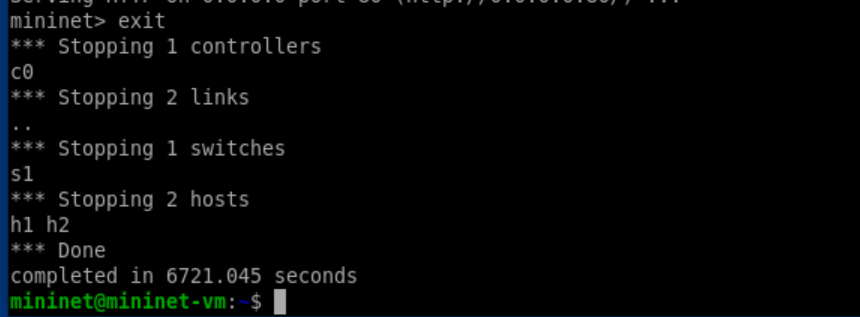{width="5.25in"
height="1.9351738845144357in"}

Execução do comando `exit`

# 8 Limpando as execuções anteriores

## 8.1 sudo mn -c

O comando `sudo mn -c` limpa processos e topologias anteriores,
liberando os recursos do sistema.

  -----------------------------------------------------------------------

  -----------------------------------------------------------------------

Execução do comando `sudo mn -c`

# 9 Comandos complexos

## 9.1 sudo mn --mac --switch ovsk

O comando `sudo mn --mac --switch ovsk` é usado para criar uma topologia
personalizada com configuração de endereços MAC automáticos e switch do
tipo Open vSwitch (OVS).

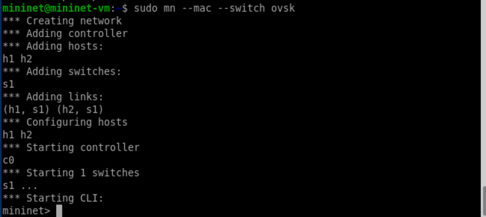{width="5.25in"
height="2.348258967629046in"}

Execução do comando `sudo mn --mac --switch ovsk`

## 9.2 sudo mn --mac --switch ovsk; h1 ping h2

O ping entre `h1` e `h2` funciona normalmente, pois o switch está
operando em modo *standalone learning switch*.

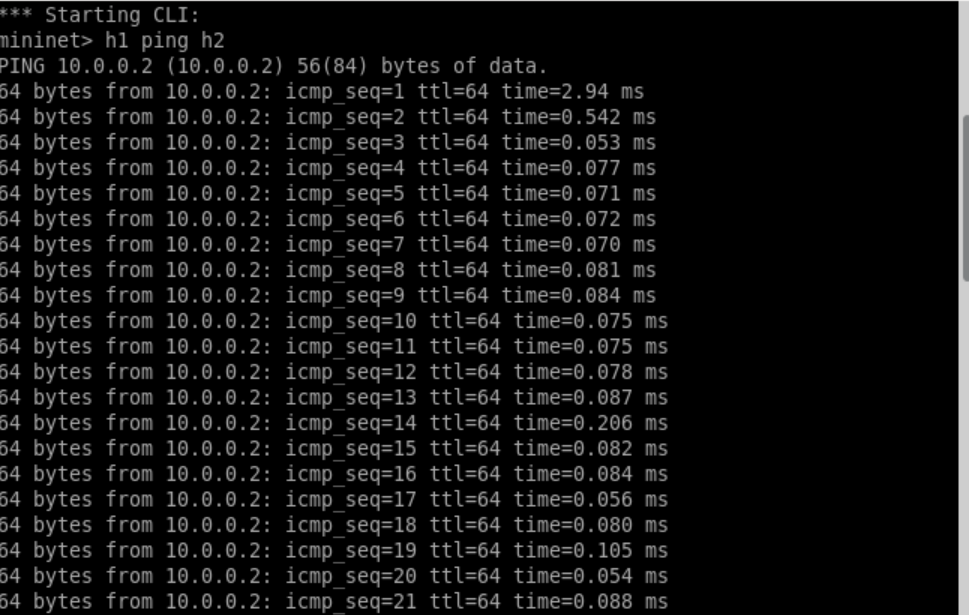{width="5.25in"
height="3.332042869641295in"}

Execução do comando `sudo mn --mac --switch ovsk; h1 ping h2`

## 9.3 sudo mn --mac --switch ovsk --controller remote

O ping entre `h1` e `h2` falha, exibindo *Destination Host Unreachable*,
pois o switch depende de um controlador remoto (via OpenFlow) e nenhum
controlador está ativo.

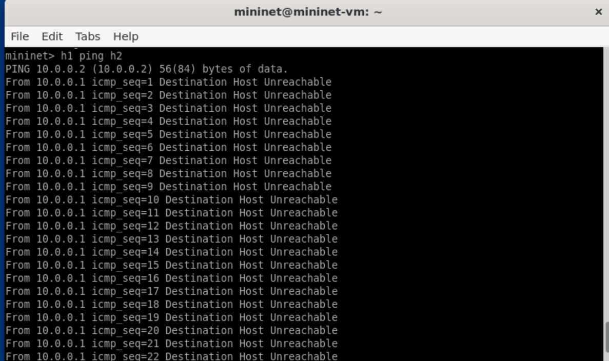{width="5.25in"
height="3.113731408573928in"}

Execução do comando
`sudo mn --mac --switch ovsk --controller remote; h1 ping h2`

# 10 Uso do iperf

## 10.1 h2 iperf -s &

O comando `h2 iperf -s &` inicia um servidor `iperf` no host `h2` em
segundo plano.

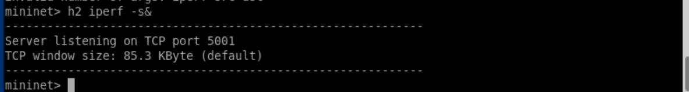{width="5.25in"
height="0.704430227471566in"}

Execução do comando `h2 iperf -s &`

## 10.2 h1 iperf -c h2 -t20 -i1

O comando `h1 iperf -c h2 -t20 -i1` executa um teste de largura de banda
do host `h1` para o host `h2`, com duração de 20 segundos e relatórios a
cada 1 segundo.

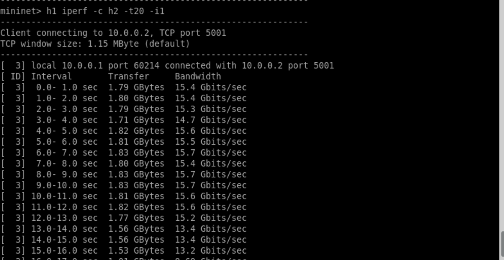{width="5.25in"
height="2.7164391951006124in"}

Execução do comando `h1 iperf -c h2 -t20 -i1`

# 11 Conclusão

O experimento demonstrou o uso de ferramentas de análise e comandos
internos do Mininet, essenciais para a inspeção de topologias emuladas.
Observou-se como cada comando auxilia na construção de conhecimento
sobre o funcionamento de redes em ambientes SDN.
