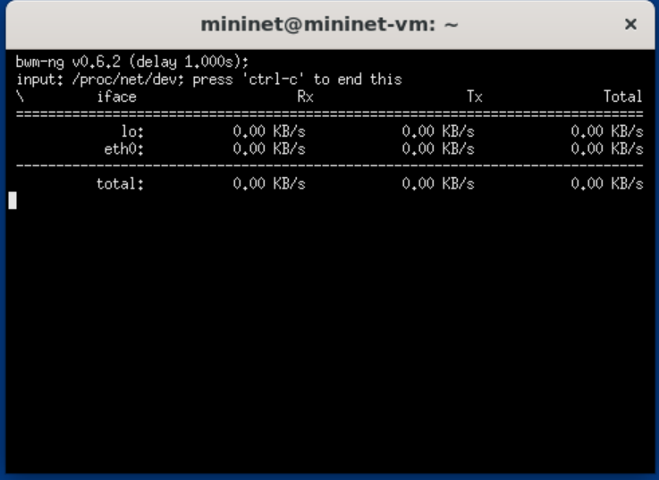
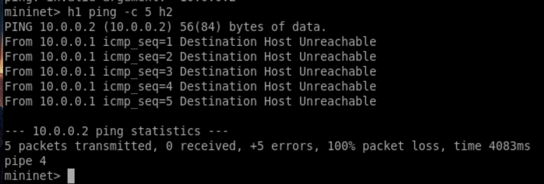
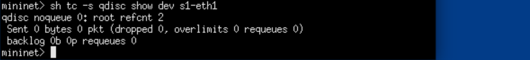
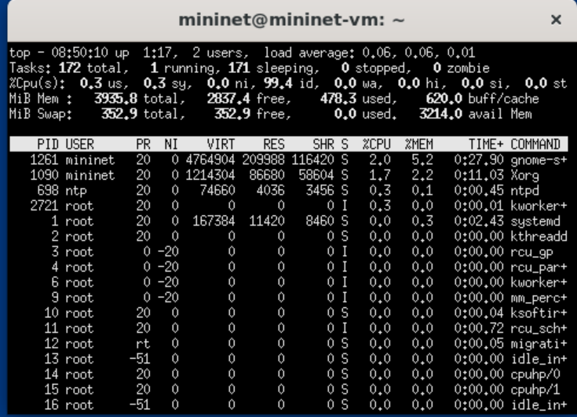
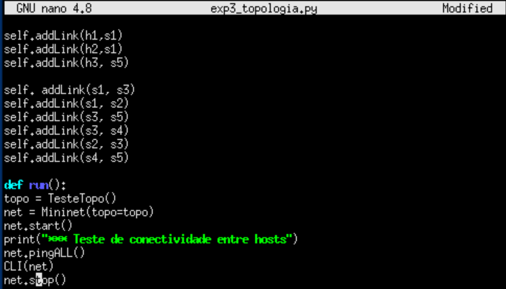
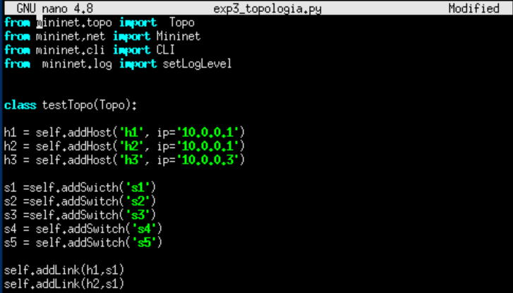

Abstract

Este relatório apresenta os resultados do Experimento 03, que tem como
objetivo explicar os modulos que são adicionados no python e outros
conceitos

# 1 Introdução

Neste trabalho é demonstrado a explicação de certos comandos.

# 2 Imports

## 2.1 import mininet.cli

Serve para abrir o terminal interativo (mininet\>) e permitir rodar
comandos nos hosts e switches da topologia emulada.

## 2.2 from mininet.log import lg, LEVELS, info, debug, warn, error, output

Lida com o sistema de logs do Mininet. info, debug, warn, error →
controlam o que aparece na tela (mensagens de status, erros, debug,
etc.). Exemplo: info(\"Criando topologia\") imprime mensagens
informativas durante a execução do script.

## 2.3 from mininet.net import Mininet, MininetWithControlNet, VERSION

Mininet: classe principal, cria a rede. MininetWithControlNet: versão
que suporta rede de controle separada (controladores externos). VERSION:
retorna a versão instalada do Mininet.

## 2.4 from mininet.node import (Host, CPULimitedHost, Controller, OVSController, Ryu, NOX, RemoteController, findController, DefaultController, NullController, UserSwitch, OVSSwitch, OVSBridge, IVSSwitch)

Host: cria hosts normais. CPULimitedHost: host com limite de CPU.
Controller: controlador genérico. OVSController: controlador padrão do
Open vSwitch. Ryu, NOX: tipos de controladores SDN externos.
RemoteController: permite usar um controlador remoto (ex.: Floodlight,
Ryu). DefaultController: controlador padrão do Mininet. NullController:
sem controlador. UserSwitch, OVSSwitch, IVSSwitch, OVSBridge: tipos de
switches suportados.

## 2.5 from mininet.nodelib import LinuxBridge

Adiciona suporte a Linux Bridge, um tipo simples de switch baseado em
bridge do Linux. Não tem tantas funções SDN como o OVS, mas pode ser
usado em testes.

## 2.6 from mininet.link import Link, TCLink, TCULink, OVSLink

Define os links da rede:

Link: link padrão.

TCLink: suporta controle de banda, atraso, perda de pacotes (usa Traffic
Control do Linux). TCULink: variante do TCLink. OVSLink: link para
switches Open vSwitch.

## 2.7 from mininet.topo import (SingleSwitchTopo, LinearTopo, SingleSwitchReversedTopo, MinimalTopo)

Topologias prontas que o Mininet fornece: SingleSwitchTopo: todos os
hosts ligados em um único switch. LinearTopo: hosts/switches em linha
(cadeia). SingleSwitchReversedTopo: variação da primeira, mas com ordem
invertida. MinimalTopo: topologia mínima (um host e um switch).

## 2.8 from mininet.topolib import TreeTopo, TorusTopo

Mais topologias pré-definidas: TreeTopo: cria topologia em árvore (muito
usada em redes hierárquicas). TorusTopo: cria topologia em anel/malha
(torus).

## 2.9 from mininet.util import customClass, specialClass, splitArgs

Funções utilitárias: customClass: permite criar classes personalizadas a
partir de strings. specialClass: parecido, mas para classes especiais.
splitArgs: ajuda a separar argumentos de forma correta.

## 2.10 from mininet.util import buildTopo

Função que constroi a topologia a partir de classes declaradas no
script. Exemplo: se definimos a nossa própria classe MyTopo, pode usar
buildTopo(MyTopo) para inicializar.

# 3 Fluxos

## 3.1 iperf -c 10.0.0.2 -u -p 1000 -i 1 -b 100M -t 180

iperf Ferramenta usada para medir desempenho de rede (largura de banda,
perda de pacotes, latência etc.).

-c 10.0.0.2 -c significa client. O que significa que este host vai rodar
o iperf como cliente e vai tentar se conectar ao servidor iperf que está
no IP 10.0.0.2.

-u Define que o teste será feito com UDP (por padrão o iperf usa TCP).
UDP é útil para testar cenários de streaming, VoIP e medir
perdas/jitter.

-p 1000 Porta utilizada para a conexão. Aqui ele vai se conectar na
porta 1000 do servidor iperf.

-i 1 Intervalo de tempo (em segundos) para exibir os resultados
parciais. Nesse caso, o iperf vai imprimir estatísticas a cada 1
segundo.

-b 100M Largura de banda que o cliente vai tentar gerar. Aqui ele vai
enviar tráfego a 100 Megabits por segundo.

-t 180 Tempo total de duração do teste (em segundos). Esse comando vai
rodar o iperf por 180 segundos (3 minutos).

# 4 hn.cmd

## 4.1 h1.cmd('while true; do date; sleep 1; done \> /tmp/date.out &'

Executa um loop infinito dentro do host h1.

O comando date imprime a data/hora atual.

sleep 1 faz uma pausa de 1 segundo entre cada impressão.

O resultado é redirecionado para o arquivo /tmp/date.out.

O & no final coloca o processo rodando em background, para não travar o
programa.

Na prática: o host h1 vai gravar a data e hora a cada 1 segundo no
arquivo /tmp/date.out.

## 4.2 h1.cmd('kill %while')

Esse comando tenta matar (encerrar) o processo em background iniciado
pelo while.

O %while faz referência ao job criado pelo loop while true\....

Assim, o script para de registrar as datas no arquivo.

Em resumo: aqui ele interrompe o teste que estava rodando em segundo
plano.

## 4.3 Help Interno

O comando `help`, digitado dentro do Mininet, lista instruções para
gerenciar a rede. Os principais são `nodes`, `net` e `dump`.

# 5 Python CLI

## 5.1 mininet.cli.CLI

CLI é uma classe em Python que provê uma interface de linha de comando
interativa para controlar e interagir com a rede simulada no Mininet.

Essa interface é a que você vê quando digita mininet\> ... no terminal
após iniciar o Mininet.

Com ela, há como enviar comandos para hosts, switches, executar testes
de rede (ping, iperf), visualizar interfaces, alterar links etc.

## 5.2 sudo mn --custom mycmd.py -v output

No Mininet, a flag -v significa verbose level (nível de detalhamento da
saída). Ela controla quanto de informação de debug/output o Mininet vai
mostrar no terminal quando você executa um experimento. Dessa forma o
parâmetro -v controla o nível de verbosidade (detalhe) das mensagens do
Mininet durante a execução.

# 6 Nível das API - Low -level API: nodes and links

## 6.1 OVSSwitch

s1 = OVSSwitch('s1', inNamespace=False) O OVSSwitch é um switch virtual
baseado no Open vSwitch (OVS). Ele é o nó que conecta os hosts e
encaminha pacotes entre eles. s1 → nome do switch. inNamespace=False →
significa que o switch não está dentro de um namespace de rede, logo ele
pode ser acessado diretamente pelo sistema host

## 6.2 Controller

c0 = Controller('c0', inNamespace=False) O Controller é o controlador da
rede. No OpenFlow/SDN, ele é quem envia as regras de encaminhamento para
os switches (como instalar fluxos, decidir o que fazer com pacotes,
etc.).

c0 → nome do controlador. inNamespace=False → não está em um namespace,
logo também pode ser acessado diretamente. o Controller centraliza as
decisões da rede, enquanto os switches apenas executam as regras que ele
manda.

## 6.3 hx.setIP()

O método setIP() atribui um endereço IP a um host (hx). Isso é
fundamental para que os hosts consigam se comunicar via protocolos de
rede (ex.: ICMP/ping). h1.setIP('10.1/8') → o host h1 recebe o IP 10.1
com máscara /8. h2.setIP('10.2/8') → o host h2 recebe o IP 10.2 com
máscara /8. Sem o setIP(), os hosts não teriam IP válido, então não
poderiam trocar pacotes via IP

# 7 Nível das API - Mid-level API: net object

## 7.1 classes em Python

Em Python, classes são estruturas que permitem criar objetos com
atributos (dados) e métodos (funções) que definem seu comportamento.
Low-level API: exige que o programador monte a rede manualmente (mais
detalhado e trabalhoso). Mid-level API: usa o objeto net para criar
topologias de forma estruturada e rápida (mais prático).

# 8 Nível das API - High-level API: Topologias

## 8.1 Classes High-level em Python

As classes High-level em Python são aquelas que herdam de classes mais
genéricas e adicionam comportamentos específicos, geralmente abstraindo
detalhes de implementação. No Mininet, isso significa criar uma classe
que representa toda uma topologia de rede, herdando da classe base Topo.
Assim, em vez de montar os hosts e switches manualmente como em
mid-level, o usuário define um modelo que pode ser reutilizado.

class SingleSwitchTopo(Topo): \"Single Switch Topology\"

def build(self, count=1): hosts = \[self.addHost('h s1 =
self.addSwitch('s1') for h in hosts: self.addLink(h, s1)

class SingleSwitchTopo(Topo): → Cria uma nova classe que herda da classe
Topo do Mininet. Isso significa que ela passa a ter todos os métodos e
atributos da classe Topo, como addHost(), addSwitch() e addLink().

def build(self, count=1): → Define o método construtor da topologia, que
cria os elementos (hosts, switches, links). O parâmetro count define
quantos hosts serão criados.

hosts = \[self.addHost('h → Cria uma lista de hosts com nomes
automáticos (h1, h2, h3, \...).

s1 = self.addSwitch('s1') → Cria o switch principal.

for h in hosts: self.addLink(h, s1) Liga cada host ao switch.

High-level classes são modelos de topologia criados como classes Python
herdando de Topo.

Elas permitem abstrair detalhes e automatizar a criação da rede.

Enquanto a mid-level controla diretamente a rede com net.addHost(), a
high-level define uma topologia inteira de forma genérica --- basta
mudar o parâmetro (SingleSwitchTopo(3)) para recriar a estrutura.

# 9 Monitoramento

## 9.1 Bandwidth (Largura de Banda)

É a quantidade máxima de dados que podem ser transmitidos de um ponto a
outro por segundo (geralmente medida em Mbps).

Ferramentas:

bwm-ng → monitora largura de banda em tempo real.

ethstats → exibe estatísticas de interface de rede (pacotes, bytes
enviados/recebidos)

{width="5.25in"
height="3.8253051181102364in"}

sudo bwm-ng -t 1000 -o plain

## 9.2 Latency

É o tempo de ida e volta (RTT) que um pacote leva para ir de um host a
outro e retornar.

{width="5.25in"
height="1.778225065616798in"}

Execução do comando h1 ping -c 5 h2

## 9.3 Queues (Filas de Transmissão)

Em uma rede, quando há congestionamento, os pacotes ficam em filas
aguardando transmissão. Monitorar essas filas mostra como o tráfego está
sendo gerenciado.

{width="5.25in"
height="0.5938910761154855in"}

Execução do comando tc -s qdisc show dev s1-eth1

## 9.4 TCP CWND (Congestion Window)

O Congestion Window (CWND) é um parâmetro do protocolo TCP que controla
quantos pacotes podem ser enviados antes de receber confirmações (ACKs).
É usado para evitar congestionamentos.

## 9.5 CPU Usage (Uso de CPU)

Mede quanto da capacidade de processamento está sendo usada pelo sistema
durante o experimento. Em redes SDN, é importante monitorar se o
controlador SDN (como o POX, Ryu ou ODL) está sobrecarregado.

{width="5.25in"
height="3.7928565179352582in"}

Execução do comando top

# 10 Topologia de Testet

{width="5.25in"
height="2.996905074365704in"}

Topologia de teste

{width="5.25in"
height="2.996905074365704in"}

Topologia de teste

# 11 Conclusão

O Experimento 03 possibilitou compreender de maneira prática o
funcionamento das ferramentas e bibliotecas utilizadas no ambiente
Mininet, evidenciando sua importância no estudo e simulação de redes
SDN.

Durante a execução, observou-se como as diferentes APIs (Low-level,
Mid-level e High-level) oferecem variados níveis de controle sobre a
rede, desde a criação manual de elementos até a definição automatizada
de topologias completas. A criação da topologia de teste em Python
reforçou o entendimento sobre a estrutura modular do Mininet e sua
capacidade de representar cenários de rede complexos de forma realista e
controlada.

Além disso, o uso de ferramentas de monitoramento e análise, como
`iperf`, `bwm-ng` e `ping`, demonstrou na prática como é possível
avaliar métricas essenciais --- como largura de banda, latência e
utilização de CPU --- dentro de um ambiente emulado.

Conclui-se que o experimento foi fundamental para consolidar o domínio
sobre o uso do Mininet e dos conceitos de redes definidas por software,
fornecendo uma base sólida para experimentos mais avançados e para o
desenvolvimento de topologias e aplicações personalizadas em SDN.
