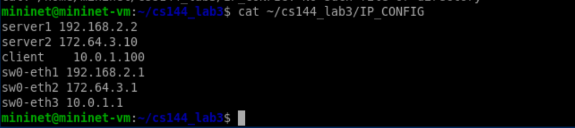
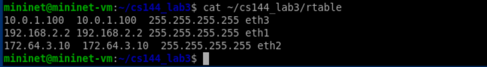
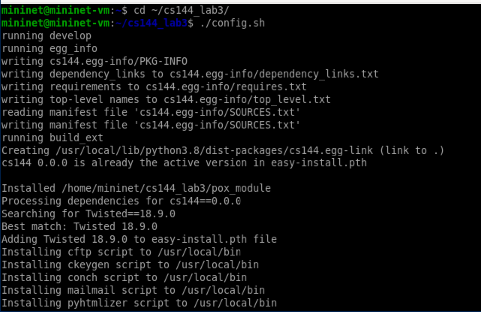
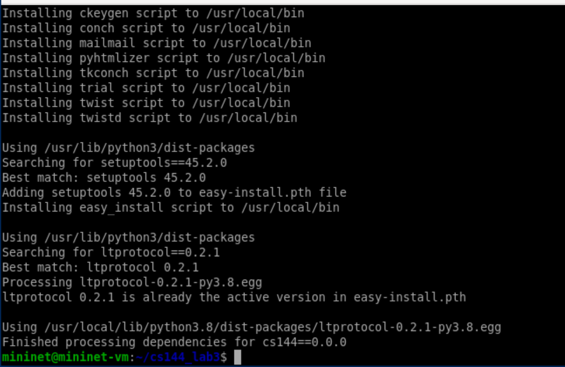
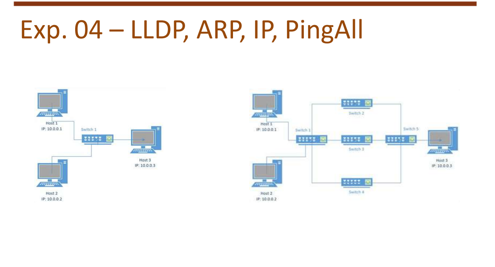

Abstract

Este relatório apresenta os resultados do Experimento 03, que tem como
objetivo explicar os módulos adicionados em Python e outros conceitos
relacionados ao funcionamento do Mininet e à comunicação em redes SDN.

# 1 Introdução

Neste trabalho são demonstrados e explicados diversos comandos e
arquivos utilizados na configuração e análise de topologias de rede, com
o objetivo de compreender o processo de comutação, roteamento e
monitoramento dentro de um ambiente SDN.

# 2 Preparação

## 2.1 cat  /cs144_lab3/IP_CONFIG

server1 e server2 são dois servidores conectados ao switch (sw0) por
interfaces diferentes.

client é o cliente final da rede.

O switch (sw0) possui três interfaces Ethernet:

eth1 conecta o switch ao server1 (rede 192.168.2.0/24)

eth2 conecta o switch ao server2 (rede 172.64.3.0/24)

eth3 conecta o switch ao cliente (rede 10.0.1.0/24)

{width="5.25in"
height="1.1721183289588801in"}

Execução do comando cat  /cs144_lab3/IP_CONFIG

## 2.2 cat  /cs144_lab3/rtable

O arquivo `rtable` descreve a tabela de roteamento utilizada pelo
switch, especificando para qual interface cada destino deve ser
encaminhado. Juntos, esses arquivos permitem a configuração e o
funcionamento correto da comunicação entre os nós na simulação da rede.

{width="5.25in"
height="0.7267552493438321in"}

Execução do comando cat  /cs144_lab3/rtable

## 2.3 ./config.sh

{width="5.25in"
height="3.4092322834645667in"}

Execução do comando ./config.sh

{width="5.25in"
height="3.4092322834645667in"}

Saída complementar do comando ./config.sh

## 2.4 Descrever as funções

**set_default_route(host):** Define a rota padrão (gateway) para cada
host da rede, permitindo que ele saiba para onde enviar pacotes
destinados a outras redes.

**cs144net():** Cria e configura a topologia de rede utilizada no
experimento --- definindo hosts, switches e interfaces de rede com seus
respectivos endereços IP. A função cria os nós da rede (server1,
server2, client), obtém as interfaces padrão e atribui endereços IP
conforme o dicionário `IP_SETTING`.

# 3 LLDP, ARP, IP, PingAll

**Rede simples:** contém 3 hosts (h1, h2 e h3) conectados a um único
switch (s1). Todos os hosts estão na mesma sub-rede e podem se comunicar
diretamente via ARP e IP.

**Rede com múltiplos switches:** os mesmos hosts estão conectados por
meio de vários switches interligados (s1 a s5), simulando uma rede mais
realista e controlada por SDN.

O protocolo LLDP é utilizado pelo controlador para descobrir
automaticamente a topologia física, enquanto o comando `PingAll` testa a
conectividade IP entre todos os hosts.

{width="5.25in"
height="2.8301509186351708in"}

LLDP, ARP, IP e PingAll

## 3.1 Análise

A figura demonstra como as camadas e protocolos cooperam para permitir
comunicação completa entre hosts --- desde a descoberta física
(LLDP/ARP) até o envio de dados via TCP/UDP e o teste de conectividade
por ICMP (PingAll).

# 4 Mapeamento de Endereços

**Protocolo ARP:** Responsável por descobrir o endereço MAC a partir de
um endereço IP dentro da mesma sub-rede. **Protocolo RARP:** Faz o
processo inverso do ARP, permitindo que um dispositivo descubra seu IP a
partir de seu MAC. Hoje, foi substituído por protocolos como BOOTP e
DHCP.

# 5 Mapeamento de Endereços 2.0

**Roteador:** Opera na camada 3 (Rede), utilizando endereços IP para
encaminhar pacotes entre redes distintas. **Bridge (Ponte):** Atua na
camada 2 (Enlace), encaminhando quadros com base em endereços MAC, sem
interpretar endereços IP.

# 6 Caminhos

## 6.1 Algoritmo de Dijkstra (SPF -- Shortest Path First)

Busca o caminho mais curto entre dois pontos, medindo o menor número de
saltos ou o menor custo total. Não suporta pesos negativos.

## 6.2 Algoritmo de Bellman-Ford

Também encontra o caminho mais curto, mas suporta pesos negativos e
detecta ciclos. É adequado para redes maiores e mais complexas.

## 6.3 Relação com o modelo OSI e a pilha TCP/IP

O roteamento ocorre na Camada de Rede (Network) do modelo OSI,
utilizando protocolos como IP, ICMP, ARP e RARP. O transporte é feito
por TCP e UDP, enquanto a aplicação usa protocolos como RPC, XDR e NFS.

## 6.4 Funcionamento do processo de roteamento

As rotas podem ser configuradas manualmente (estáticas) ou descobertas
automaticamente por protocolos de roteamento, como OSPF, RIP (IGP) e BGP
(EGP). As informações de rotas são mantidas em duas bases principais:
RIB (Routing Information Base) e FIB (Forwarding Information Base).

# 7 Conclusão

O Experimento 04 permitiu compreender, de forma prática e integrada, o
funcionamento dos principais componentes do ambiente Mininet e sua
relevância para o estudo de redes definidas por software (SDN). A
atividade possibilitou observar como a definição de topologias, o
roteamento e a comutação podem ser reproduzidos de maneira controlada e
flexível, aproximando o ambiente de simulação de situações reais de
operação em redes.

Durante o experimento, foi possível explorar diferentes níveis de
abstração oferecidos pelas APIs do Mininet (Low-level, Mid-level e
High-level), evidenciando o equilíbrio entre controle granular e
automação no processo de criação e gerenciamento das topologias. A
implementação em Python destacou a modularidade da ferramenta e a
clareza com que os conceitos de enlace, roteamento e descoberta de
vizinhança (por meio de protocolos como LLDP e ARP) podem ser
visualizados e testados.

O uso de ferramentas complementares, como `ping`, `iperf` e `bwm-ng`,
reforçou a importância da análise de desempenho e do monitoramento
contínuo em redes SDN, permitindo mensurar parâmetros essenciais como
latência, throughput e utilização de recursos. Esses resultados
evidenciam a utilidade do Mininet como ambiente de experimentação e
aprendizado.

Conclui-se, portanto, que o experimento contribuiu significativamente
para a consolidação dos conceitos de comutação, roteamento e controle
centralizado em redes SDN. Além disso, estabeleceu uma base técnica
sólida para o desenvolvimento de topologias mais complexas e para a
futura integração com controladores e aplicações avançadas de redes
definidas por software.
