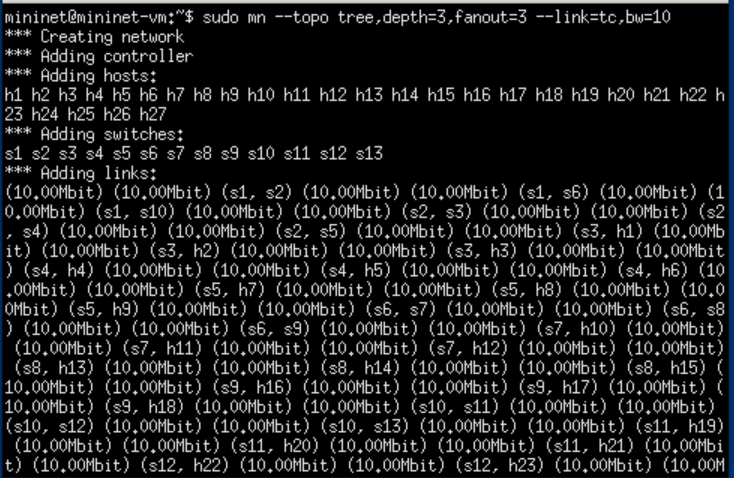
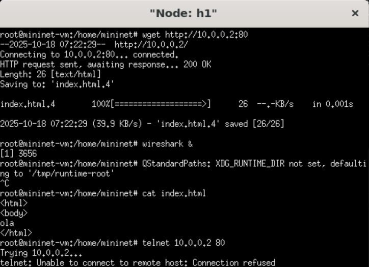
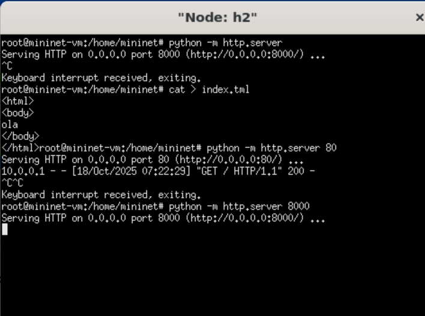
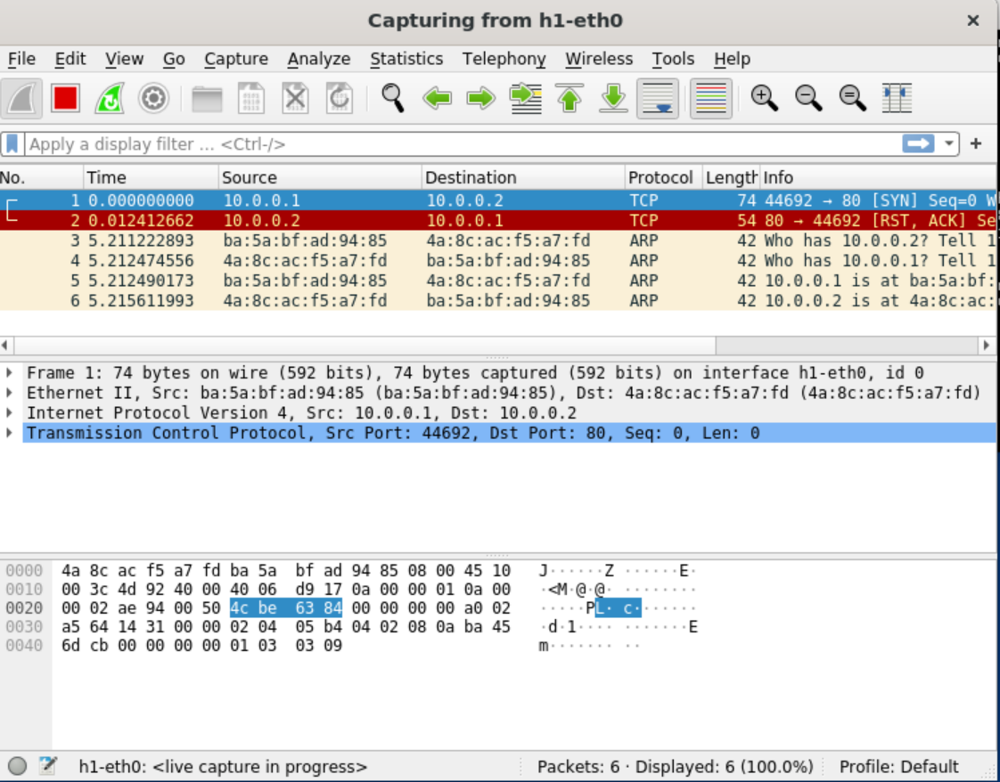
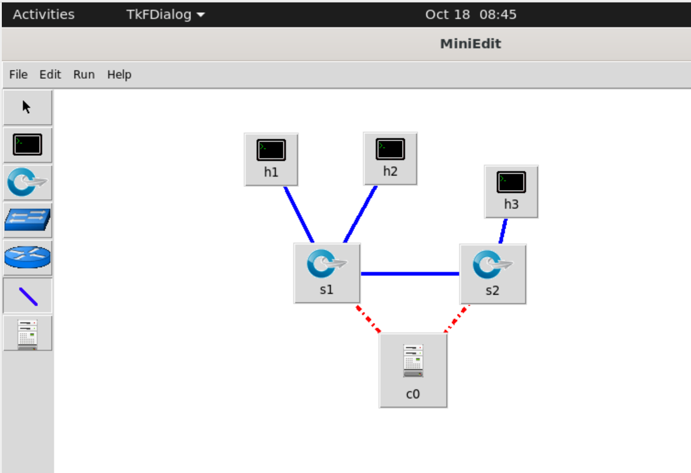
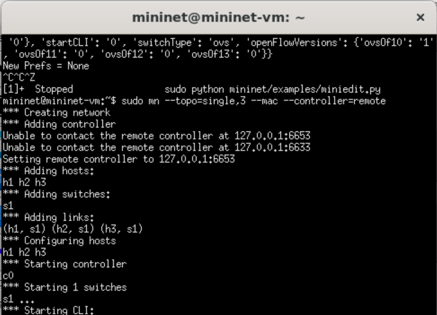
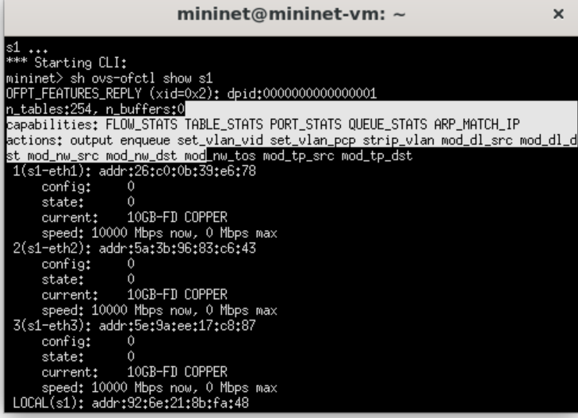
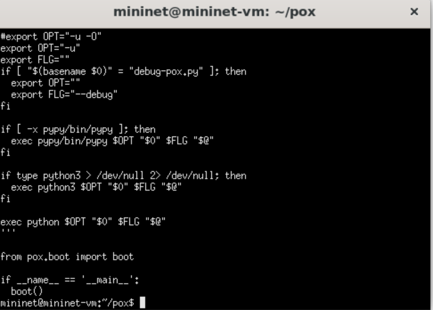
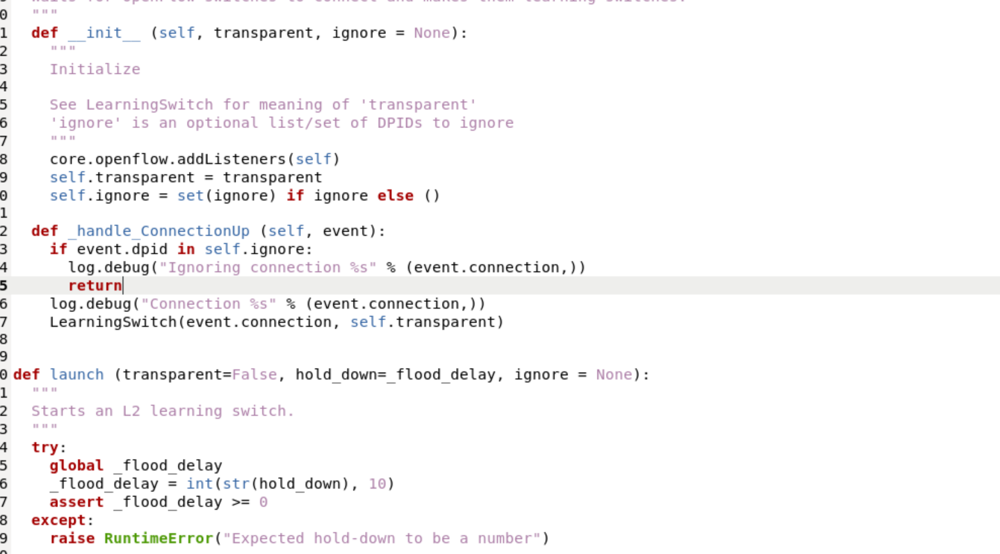

Abstract

Este relatório apresenta os resultados do Experimento 04, que tem como
objetivo explicar os módulos adicionados no Python e outros conceitos.

# 1 Introdução

Neste trabalho são explicados certos comandos utilizados no ambiente
Mininet e sua aplicação prática.

# 2 Imports

## 2.1 Comando: `sudo mn --topo tree,depth=3,fanout=3 --link=tc,bw=10`

Esse comando define a construção de uma topologia em árvore (tree) com
profundidade 3 e fanout igual a 3, ou seja, cada switch da rede (exceto
os de nível mais baixo) possui três nós conectados a ele --- que podem
ser outros switches ou hosts.

{width="5.25in"
height="3.4189370078740158in"}

Topologia gerada pelo comando
`sudo mn --topo tree,depth=3,fanout=3 --link=tc,bw=10`.

# 3 Execução dos nós h1 e h2

## 3.1 Host h1

A seguir são apresentados os resultados do nó `h1`, que atua como
cliente no experimento.

{width="5.25in"
height="3.8069750656167978in"}

Execução do host `h1`.

## 3.2 Host h2

O nó `h2` atua como servidor HTTP, servindo páginas para o cliente.

{width="5.25in"
height="3.9078379265091865in"}

Execução do host `h2`.

# 4 Wireshark

A captura de pacotes realizada no `h1-eth0` permite observar o
comportamento do tráfego entre os nós.

{width="5.25in"
height="4.108288495188101in"}

Captura de pacotes no Wireshark.

O Wireshark confirma o comportamento: quando `h2` estava servindo HTTP
na porta 80, `h1` conseguiu baixar a página com sucesso. Após `h2` mudar
o servidor para a porta 8000, `h1` tentou acessar novamente a 80 e
recebeu um TCP Reset (porta fechada).

# 5 sudo python mini/examples/miniedit.py

Quando você abre o MiniEdit e vai em Edit → Preferences, aparece uma
janela onde você configura:

Qual controladora usar (IP e porta);

Que tipo de switch e links serão criados;

Versão do OpenFlow;

Tipo de terminal (para abrir os hosts/switches em janelas separadas);

E se deseja que o Mininet abra automaticamente o CLI.

Essas configurações definem o comportamento padrão da simulação antes
mesmo de montar a topologia.

{width="5.25in"
height="3.5928379265091865in"}

Caixas de diálogo no MiniEdit.

# 6 sudo mn --topo=single,3 --mac --controller=remote

--topo=single,3 → cria uma topologia simples com 1 switch e 3 hosts;

--mac → atribui endereços MAC automaticamente e de forma sequencial;

--controller=remote → indica que o switch vai tentar se conectar a uma
controladora externa (por exemplo, no IP 127.0.0.1:6633).

{width="5.25in"
height="3.7952668416447946in"}

Execução do comando `sudo mn --topo=single,3 --mac --controller=remote`.

# 7 sh ovs-ofctl show s1

As portas disponíveis (ex: eth1, eth2, eth3);

O estado de cada porta;

O número de dpid (datapath ID);

Conexões com o controlador.

{width="5.25in"
height="3.7952668416447946in"}

Resultado do comando `sh ovs-ofctl show s1`.

# 8 Imports

Host: representa um host comum, que pode executar comandos e aplicações.

CPULimitedHost: host com limitação de CPU.

Controller: classe base para controladoras SDN.

OVSController: controlador baseado no Open vSwitch.

NOX, Ryu, RemoteController: exemplos de controladores externos que podem
ser integrados ao Mininet.

NullController: um controlador "vazio" (sem lógica), usado para
simulações sem controle SDN.

OVSKernelSwitch: switch que usa o kernel do Linux (mais eficiente).

OVSSwitch: switch padrão do Mininet, também baseado em Open vSwitch.

OVSBridge: atua como um bridge simples, sem controle SDN.

# 9 pox.py

O arquivo `pox.py` é o principal responsável por iniciar o controlador
POX, preparando o ambiente e chamando a função `boot()` para carregar os
módulos necessários.

{width="5.25in"
height="3.759258530183727in"}

Arquivo `pox.py`.

# 10 classes controller

{width="5.25in"
height="2.9119422572178477in"}

Classe `l2_learning.py`.

Quando um switch se conecta → o controlador POX cria uma instância de
`LearningSwitch` para controlá-lo.

# 11 self.net

topo=None Define a topologia da rede (por exemplo, árvore, linear,
personalizada). None indica que a topologia será criada manualmente.

cleanup=True Remove restos de execuções anteriores do Mininet
(interfaces, processos, etc.) antes de iniciar a nova rede.

host=CPULimitedHost Define o tipo de host. CPULimitedHost permite
limitar o uso de CPU de cada host, útil para simular restrições reais.

link=TCLink Define o tipo de enlace entre os nós. TCLink permite
configurar parâmetros como largura de banda, atraso e perda de pacotes.

switch=OVSKernelSwitch Define o tipo de switch usado. OVSKernelSwitch
usa o Open vSwitch em modo kernel (mais rápido e realista).

autoSetMacs=True Faz o Mininet atribuir automaticamente endereços MAC
únicos a cada host.

autoStaticArp=True Cria automaticamente entradas ARP estáticas (associa
IP ↔ MAC), evitando broadcasts desnecessários.

autoPinCpus=True Faz o Mininet fixar hosts virtuais em CPUs físicas
diferentes, reduzindo interferências.

waitConnected=True Faz o script aguardar até que os switches estejam
conectados antes de prosseguir.

build=True Indica que a rede deve ser construída imediatamente após a
criação do objeto Mininet.

inNamespace=False Define se os switches devem ser executados em
namespaces de rede separados. False → executam no namespace raiz (mais
comum).

\# intf = Intf Parâmetro comentado; serviria para definir interfaces
físicas externas a serem adicionadas à rede virtual.

\# xterms=False Também comentado; se ativado, abriria janelas de
terminal (xterm) para cada host.

listenPort=None Define uma porta de escuta para o controlador remoto.
None → sem porta específica.

# 12 Conclusão

O Experimento 04 possibilitou compreender de maneira prática o
funcionamento das ferramentas e bibliotecas utilizadas no ambiente
Mininet, evidenciando sua importância no estudo e simulação de redes
SDN.

Durante a execução, observou-se como as diferentes APIs (Low-level,
Mid-level e High-level) oferecem variados níveis de controle sobre a
rede, desde a criação manual de elementos até a definição automatizada
de topologias completas.

Conclui-se que o experimento foi fundamental para consolidar o domínio
sobre o uso do Mininet e dos conceitos de redes definidas por software,
fornecendo uma base sólida para experimentos mais avançados e para o
desenvolvimento de topologias e aplicações personalizadas em SDN.
