Abstract

Este relatório apresenta os resultados do Experimento 05, cujo objetivo
é explorar o funcionamento de diferentes controladoras SDN, com foco na
utilização do controlador POX e na análise de suas funcionalidades e
módulos dentro do ambiente Mininet.

# 1 Introdução

Este trabalho apresenta e analisa comandos e arquivos utilizados na
configuração e no monitoramento de uma topologia de Rede Definida por
Software (SDN). O experimento tem como objetivo compreender o
funcionamento da comunicação entre o controlador POX, os switches
OpenFlow e os hosts no ambiente Mininet.

Além disso, são analisados mecanismos de aprendizado de endereços MAC,
descoberta de topologia, gerenciamento de fluxos e monitoramento dos
hosts conectados à rede.

# 2 Configuração Inicial do Mininet

## 2.1 Execução do Miniedit

O Miniedit é uma interface gráfica utilizada para facilitar a criação e
a configuração de topologias no Mininet. Sua execução pode ser realizada
por meio do seguinte comando:

    sudo python ~/mininet/examples/miniedit.py

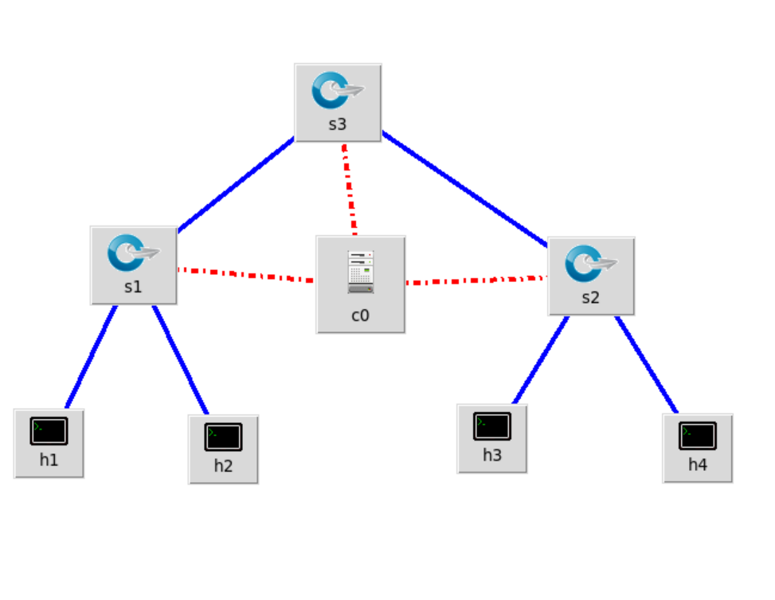{width="5.25in"
height="4.062949475065617in"}

Execução do Miniedit para configuração da topologia.

# 3 Execução do Controlador POX

## 3.1 Inicialização do POX

O controlador POX pode ser iniciado utilizando diferentes módulos. No
experimento, foi utilizado o seguinte comando:

    sudo python ~/pox/pox.py forwarding.l2_pairs
    info.packet_dump samples.pretty_log
    log.level --DEBUG

O módulo `forwarding.l2_pairs` permite realizar o encaminhamento de
pacotes com base nos endereços da camada 2. Os demais módulos fornecem
mecanismos de visualização e depuração das informações geradas pelo
controlador.

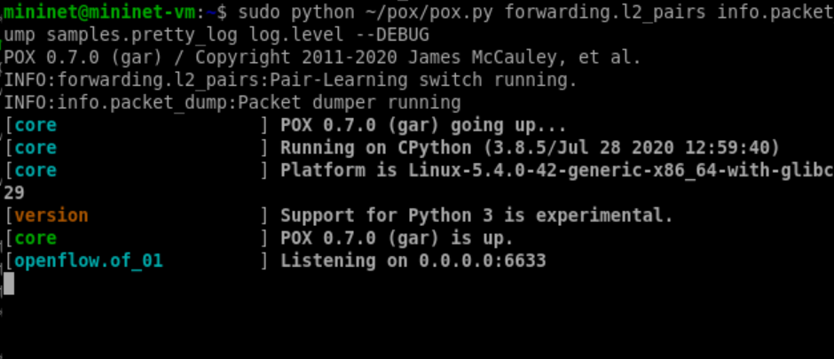{width="5.25in"
height="2.2619674103237095in"}

Execução do controlador POX com os módulos definidos.

## 3.2 Configuração de Endereço e Porta

Também pode ser especificado o endereço IP e a porta utilizados pelo
controlador:

    sudo ~/pox/pox.py openflow.of_01
    --address=10.1.1.1 --port=6634

O parâmetro `--address` define o endereço IP no qual o controlador
aceitará conexões, enquanto o parâmetro `--port` define a porta
utilizada para a comunicação OpenFlow.

# 4 Resultados do Experimento

## 4.1 Teste de Conectividade com `pingall`

O comando `pingall` é utilizado no Mininet para testar a conectividade
entre todos os hosts da topologia.

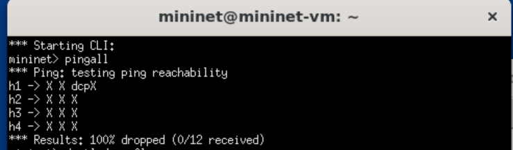{width="5.25in"
height="1.5416097987751531in"}

Resultado do comando `pingall`.

O resultado permite verificar se os hosts da topologia conseguem
estabelecer comunicação entre si.

## 4.2 Visualização dos Fluxos

O comando `dpctl dump-flows` permite visualizar as regras de fluxo
instaladas nos switches OpenFlow.

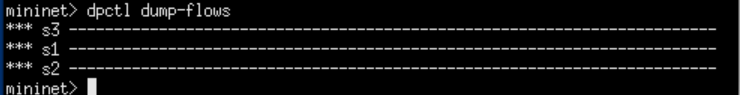{width="5.25in"
height="0.6739862204724409in"}

Visualização das regras de fluxo com `dpctl dump-flows`.

A análise das entradas da tabela de fluxos permite observar como o
controlador determina o encaminhamento dos pacotes dentro da rede.

## 4.3 Tabelas ARP dos Hosts

As tabelas ARP permitem verificar a associação entre endereços IP e
endereços MAC conhecidos pelos hosts.

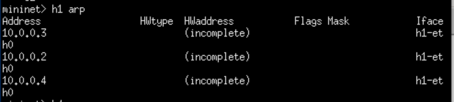{width="5.25in"
height="1.1831977252843395in"}

Tabela ARP do host H1.

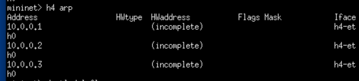{width="5.25in"
height="1.1831977252843395in"}

Tabela ARP do host H4.

## 4.4 Remoção dos Fluxos

O comando `dpctl del-flows` pode ser utilizado para remover as regras de
fluxo instaladas nos switches.

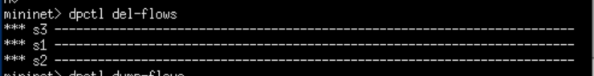{width="5.25in"
height="0.6739862204724409in"}

Remoção das regras de fluxo com `dpctl del-flows`.

# 5 Topologia e Comandos Avançados

A topologia utilizada no segundo momento do experimento foi configurada
no Miniedit.

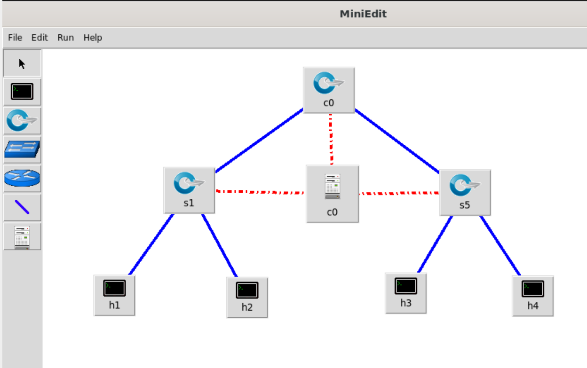{width="5.25in"
height="3.293869203849519in"}

Topologia configurada no Miniedit.

## 5.1 Execução Avançada do POX

Para realizar uma análise mais completa da rede, foram utilizados
diversos módulos do POX simultaneamente:

    sudo python ~/pox/pox.py forwarding.l2_learning
    openflow.spanning_tree --no-flood --hold-down
    log.level --DEBUG samples.pretty_log
    openflow.discovery host_tracker info.packet_dump

A utilização conjunta desses módulos permite analisar o aprendizado de
endereços MAC, a descoberta da topologia, o controle de loops, o
monitoramento dos hosts e a geração de informações detalhadas para
depuração.

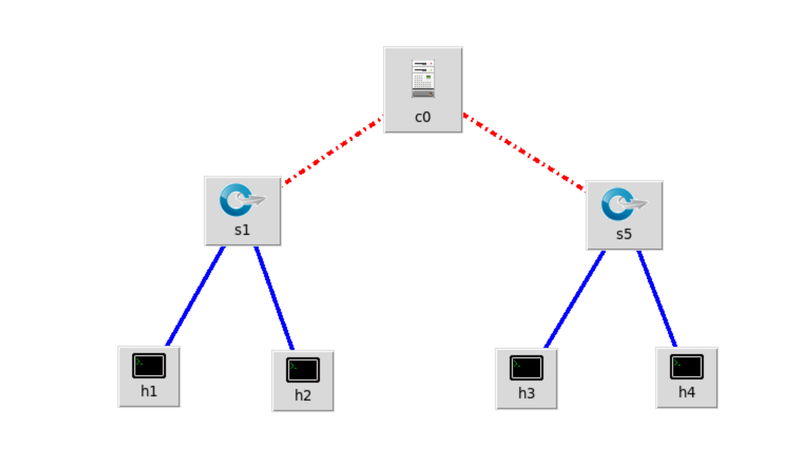{width="5.25in"
height="3.0904254155730535in"}

Execução do POX com múltiplos módulos.

## 5.2 Teste de Comunicação entre Hosts

Após a inicialização dos módulos adicionais, foi realizado um teste de
comunicação entre os hosts utilizando o comando:

    h1 ping -c1 h4

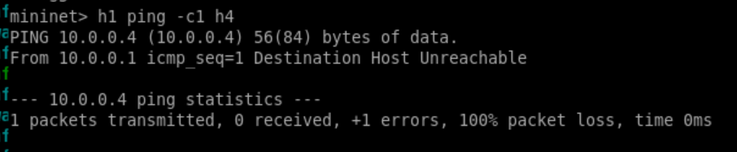{width="5.25in"
height="1.0836089238845144in"}

Execução do comando `h1 ping -c1 h4`.

O teste permite verificar se o encaminhamento dos pacotes entre H1 e H4
está funcionando corretamente.

## 5.3 Tabelas ARP após a Comunicação

Após a execução do ping, as tabelas ARP dos hosts podem ser novamente
consultadas para verificar as associações aprendidas durante a
comunicação.

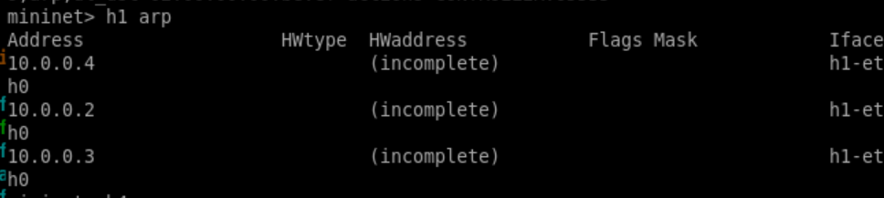{width="5.25in"
height="1.176910542432196in"}

Tabela ARP do H1 após o envio de ping.

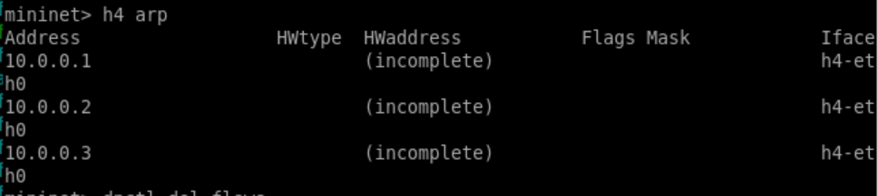{width="5.25in"
height="1.176910542432196in"}

Tabela ARP do H4 após a comunicação.

# 6 Logs do Controlador POX

Os logs gerados pelo controlador permitem acompanhar os eventos que
ocorrem durante a execução do experimento, incluindo conexões OpenFlow,
descoberta de dispositivos e processamento de pacotes.

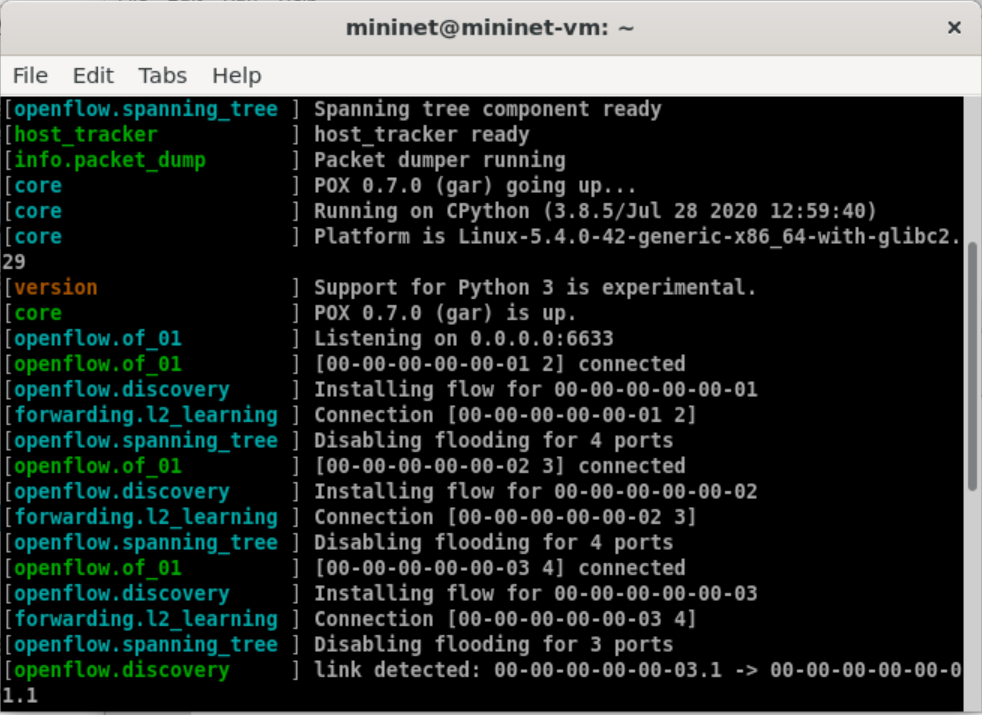{width="5.25in"
height="3.8225557742782152in"}

Log de monitoramento do controlador POX.

# 7 Principais Módulos do POX

## 7.1 `forwarding.l2_learning`

O módulo `forwarding.l2_learning` implementa um mecanismo de aprendizado
de camada 2. O controlador associa endereços MAC às portas dos switches
e utiliza essas informações para determinar o encaminhamento dos
quadros.

## 7.2 `openflow.discovery`

O módulo `openflow.discovery` realiza a descoberta da topologia da rede
por meio de mensagens LLDP, permitindo que o controlador identifique os
enlaces existentes entre os switches.

## 7.3 `openflow.spanning_tree`

O módulo `openflow.spanning_tree` auxilia no controle de loops em
topologias que possuem caminhos redundantes.

A opção `--no-flood` impede o flooding convencional de determinadas
mensagens, enquanto a opção `--hold-down` pode ser utilizada para evitar
alterações prematuras durante o processo de estabelecimento da
topologia.

## 7.4 `host_tracker`

O módulo `host_tracker` monitora os hosts conectados à rede e mantém
informações relacionadas aos seus endereços IP, endereços MAC e portas
de conexão.

## 7.5 `info.packet_dump` e `log.level --DEBUG`

O módulo `info.packet_dump` fornece informações sobre os pacotes
recebidos pelo controlador.

Já o parâmetro `log.level --DEBUG` aumenta o nível de detalhamento dos
registros produzidos pelo POX, facilitando a análise e a depuração do
experimento.

## 7.6 `samples.pretty_log`

O módulo `samples.pretty_log` modifica a apresentação das mensagens de
log, tornando as informações produzidas pelo controlador mais
organizadas e legíveis.

# 8 Conclusão

O Experimento 05 permitiu compreender, de forma prática, o funcionamento
de diferentes componentes envolvidos em uma rede definida por software,
com ênfase na utilização do controlador POX em conjunto com o ambiente
Mininet.

A execução dos comandos possibilitou observar a comunicação entre o
controlador e os switches OpenFlow, o aprendizado de endereços MAC, a
instalação e remoção de regras de fluxo, a descoberta da topologia e o
monitoramento dos hosts.

Além disso, a utilização de diferentes módulos do POX demonstrou como
funcionalidades específicas podem ser combinadas para controlar e
analisar o comportamento da rede SDN. Dessa forma, o experimento
contribuiu para a consolidação dos conceitos de controle centralizado,
comutação e gerenciamento de redes definidas por software.
