Abstract

Este relatório apresenta os resultados do Experimento 06, cujo objetivo
é estudar o funcionamento do protocolo Spanning Tree (STP) em um
ambiente de Redes Definidas por Software (SDN), utilizando a
controladora Ryu e o emulador Mininet. O experimento aborda a
configuração inicial da controladora, a construção de uma topologia com
redundância, a análise dos estados das portas dos switches e a
observação do comportamento da rede por meio de comandos como `ping`,
`tcpdump` e `ifconfig`.

# 1 Introdução

Este trabalho apresenta e analisa os procedimentos utilizados para
configurar uma rede SDN com a controladora Ryu e o ambiente Mininet.

O principal objetivo do experimento é compreender o funcionamento do
protocolo Spanning Tree Protocol (STP), responsável por evitar loops de
camada 2 em topologias que possuem caminhos redundantes entre os
switches.

Durante o experimento, são analisados o processo de configuração da
controladora Ryu, a construção da topologia, os estados das portas dos
switches, a comunicação entre os hosts e o comportamento da rede diante
da interrupção e posterior reativação de enlaces.

# 2 Preparações Iniciais (01)

## 2.1 Instalação do Ryu

Inicialmente, foi realizada a instalação da controladora Ryu no ambiente
utilizado para o experimento.

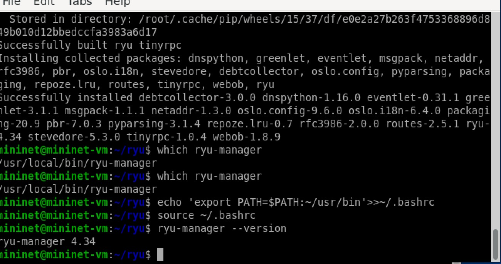{width="5.25in"
height="2.7703838582677167in"}

Instalação da controladora Ryu.

# 3 Preparações Iniciais (02)

## 3.1 Teste 1 -- Terminal 1

No primeiro terminal, foi executada a controladora Ryu utilizando a
aplicação responsável pelo funcionamento do switch OpenFlow.

    ryu-manager ryu.app.simple_switch_13

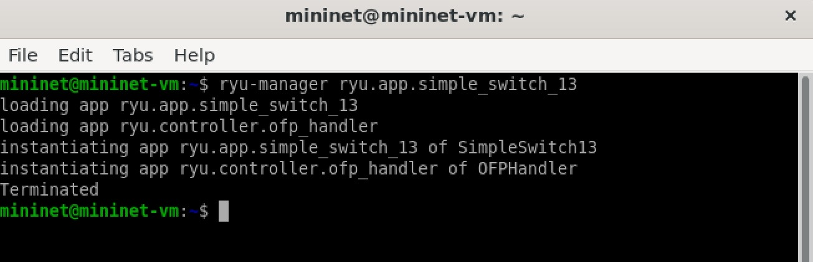{width="5.25in"
height="1.6977001312335958in"}

Execução do comando `ryu-manager ryu.app.simple_switch_13`.

## 3.2 Teste 2 -- Terminal 2

No segundo terminal, foi iniciado o Mininet utilizando uma topologia
composta por um switch e três hosts, com conexão a uma controladora
remota.

    sudo mn --topo single,3 --controller=remote --mac --switch ovsk

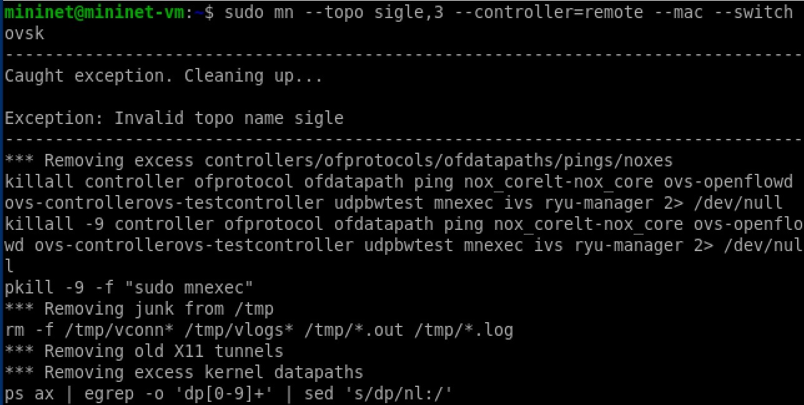{width="5.25in"
height="2.649456474190726in"}

Execução do Mininet com um switch e três hosts.

# 4 Preparações Iniciais (03)

## 4.1 Alteração do Arquivo no Gedit

Foi realizada uma alteração em um arquivo de configuração utilizando o
editor de texto Gedit. A alteração está relacionada ao endereço
multicast utilizado pelo protocolo Spanning Tree.

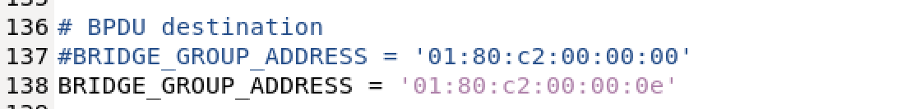{width="5.25in"
height="0.6349267279090114in"}

Alteração do endereço `01:80:c2:00:00:00` no arquivo de configuração.

# 5 Conhecendo o Ryu

Nesta etapa, foram analisados os arquivos e diretórios relacionados à
instalação da controladora Ryu.

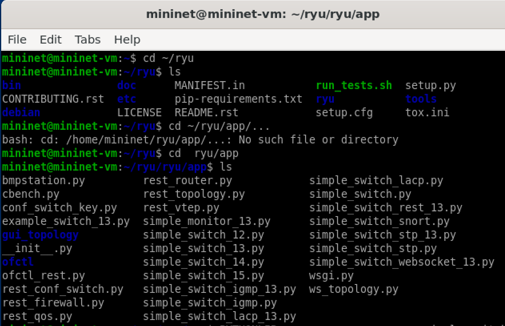{width="5.25in"
height="3.391923665791776in"}

Acesso ao diretório relacionado à controladora Ryu.

# 6 Mininet -- `examples/spanning_tree.py`

Nesta etapa do experimento, foi utilizada uma topologia com enlaces
redundantes para observar o funcionamento do protocolo Spanning Tree.

A execução do exemplo permite analisar como o STP identifica caminhos
redundantes e determina quais enlaces devem permanecer ativos ou
bloqueados.

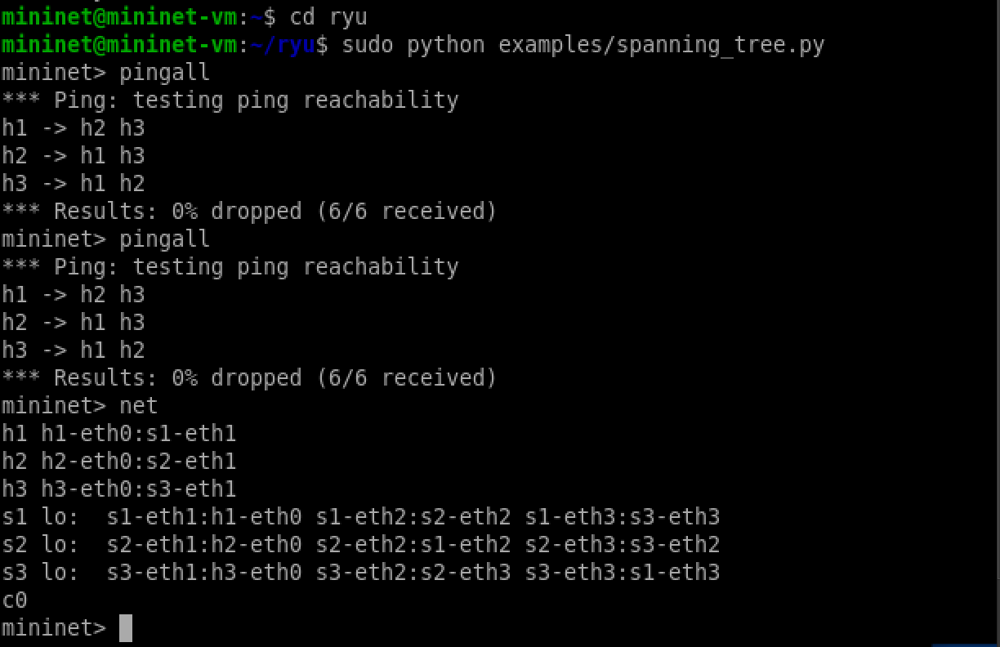{width="5.25in"
height="3.3970581802274715in"}

Execução do exemplo de Spanning Tree no Mininet.

## 6.1 Comando `pingall`

O comando `pingall` é utilizado para verificar a conectividade entre
todos os hosts presentes na topologia.

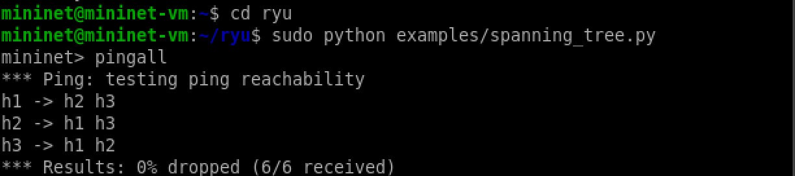{width="5.25in"
height="1.1666666666666667in"}

Teste de conectividade utilizando o comando `pingall`.

## 6.2 Comando `net`

O comando `net` permite visualizar as conexões existentes entre os
hosts, switches e interfaces da topologia.

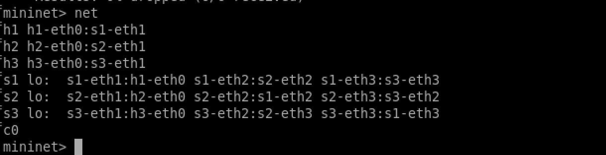{width="5.25in"
height="1.3544225721784777in"}

Visualização das conexões da topologia com o comando `net`.

## 6.3 Estado do Spanning Tree

Os comandos relacionados ao STP permitem observar o estado das portas
dos switches e identificar quais enlaces estão em estado de
encaminhamento e quais estão bloqueados.

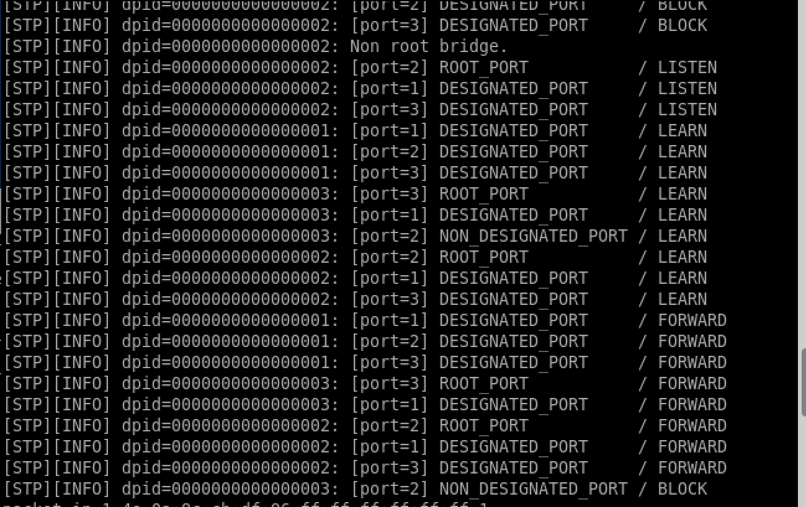{width="5.25in"
height="3.306003937007874in"}

Estado das portas durante a execução do STP.

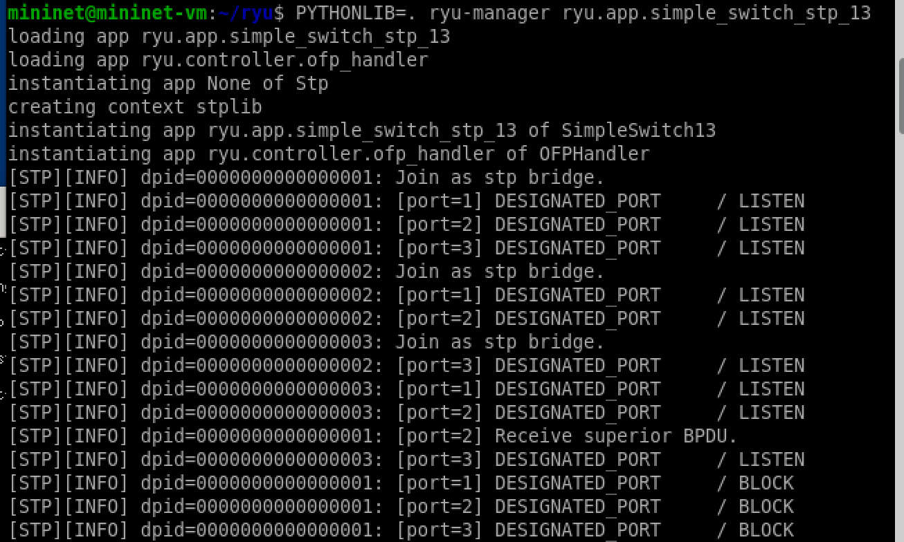{width="5.25in"
height="3.1516076115485565in"}

Informações adicionais sobre o estado do STP.

# 7 `tcpdump` -- Análise de Pacotes ICMP

O comando `tcpdump` foi utilizado para observar os pacotes ICMP que
trafegam pelas interfaces dos switches.

Um exemplo de comando utilizado no experimento é:

    tcpdump -i s<n>-eth2 icmp

Esse procedimento permite acompanhar os pacotes ICMP gerados pelos
comandos `ping` e verificar por quais enlaces o tráfego está passando.

## 7.1 `h1 ping h2`

Foi realizado um teste de comunicação entre os hosts H1 e H2.

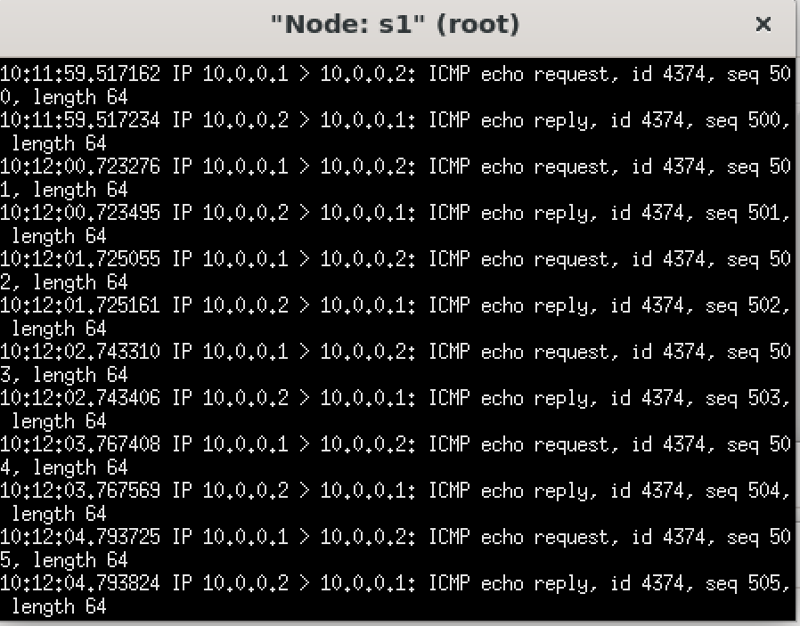{width="5.25in"
height="4.109966097987751in"}

Teste de comunicação de H1 para H2.

A captura permite observar os pacotes ICMP relacionados à comunicação
entre os dois hosts.

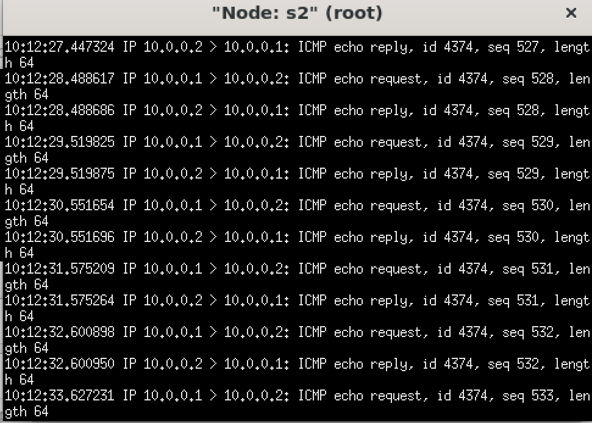{width="5.25in"
height="3.752316272965879in"}

Captura dos pacotes ICMP durante a comunicação entre H1 e H2.

## 7.2 `h2 ping h3`

Em seguida, foi realizado um teste de comunicação entre os hosts H2 e
H3.

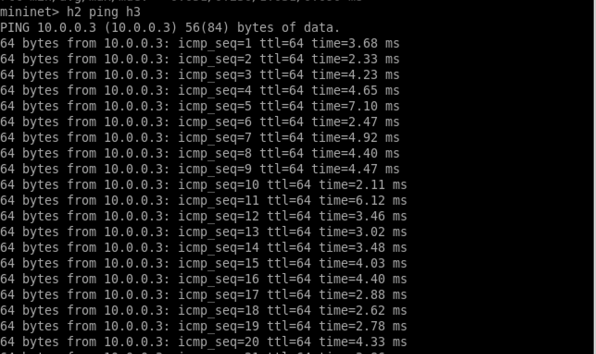{width="5.25in"
height="3.1247080052493437in"}

Teste de comunicação de H2 para H3.

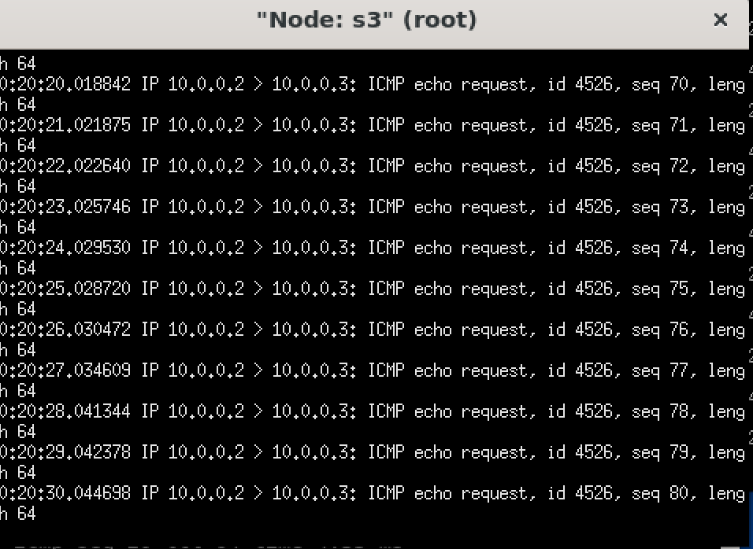{width="5.25in"
height="3.833158355205599in"}

Captura dos pacotes ICMP durante a comunicação entre H2 e H3.

# 8 Interrupção de Enlace

Para analisar o comportamento do STP diante de uma alteração na
topologia, foi realizada a desativação de uma das interfaces do switch.

## 8.1 Comando `ifconfig s2-eth2 down`

O comando abaixo desativa a interface `s2-eth2`:

    ifconfig s2-eth2 down

A interrupção do enlace permite observar como o STP reage à mudança da
topologia e como os enlaces anteriormente bloqueados podem ser
utilizados para manter a conectividade.

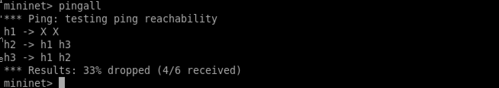{width="5.25in"
height="0.9311920384951881in"}

Desativação da interface `s2-eth2`.

## 8.2 Comando `ifconfig s2-eth2 up`

Após a análise da falha, a interface foi novamente ativada utilizando o
comando:

    ifconfig s2-eth2 up

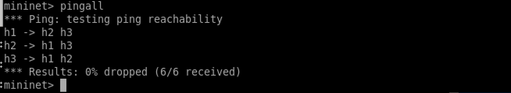{width="5.25in"
height="0.9633027121609798in"}

Reativação da interface `s2-eth2`.

A reativação permite observar novamente o processo de convergência do
STP e as alterações nos estados das portas.

# 9 Estudo da Topologia

Nesta etapa, foi realizada a análise da topologia utilizada no
experimento. Foram considerados os seguintes aspectos:

-   identificação de qual host está conectado a cada switch;

-   identificação dos endereços IP utilizados pelos hosts;

-   identificação dos IDs dos switches;

-   representação da rede após sua montagem no experimento;

-   identificação do papel de cada switch no protocolo STP.

A análise desses elementos permite compreender a relação entre a
topologia física e a topologia lógica estabelecida pelo STP.

## 9.1 Papel dos Switches no STP

O STP estabelece uma hierarquia entre os switches da rede. A partir das
informações trocadas entre eles, é escolhido um switch como referência
para a árvore, denominado *Root Bridge*.

Os demais switches calculam os caminhos até o dispositivo raiz e
determinam quais portas devem encaminhar tráfego e quais devem
permanecer bloqueadas para evitar a formação de loops de camada 2.

# 10 Estudo da Imagem 1.2

A imagem analisada apresenta as diferentes redes e sub-redes utilizadas
na topologia do experimento.

A representação permite:

-   identificar as redes utilizadas na topologia;

-   compreender o caminho percorrido pelos pacotes;

-   observar como o STP interfere na utilização dos enlaces;

-   configurar os endereços IP dos hosts;

-   realizar testes de conectividade utilizando `ping`;

-   analisar o tráfego utilizando `tcpdump`.

Durante essa etapa, a configuração dos endereços IP foi realizada nos
hosts, enquanto o encaminhamento entre os switches foi controlado pela
infraestrutura SDN.

# 11 Estudo dos Comandos

## 11.1 `ip addr del 10.0.0.1/8 dev h1-eth0`

O comando abaixo remove o endereço IP padrão atribuído pelo Mininet à
interface do host:

    ip addr del 10.0.0.1/8 dev h1-eth0

Esse procedimento é utilizado para remover a configuração padrão e
permitir que seja atribuído ao host o endereço IP correspondente à
sub-rede definida no experimento.

## 11.2 `ip addr add 172.16.20.10/24 dev h1-eth0`

O comando abaixo atribui um novo endereço IP à interface do host:

    ip addr add 172.16.20.10/24 dev h1-eth0

Nesse exemplo, o host recebe o endereço IP `172.16.20.10` com máscara
`/24`. Cada host pode receber um endereço diferente de acordo com a
sub-rede correspondente à topologia.

## 11.3 `ip route add default via 172.16.20.1`

O comando abaixo configura uma rota padrão:

    ip route add default via 172.16.20.1

A rota padrão define o próximo salto utilizado para destinos que não
pertencem diretamente à rede local.

No contexto do experimento, essa configuração permite estudar o
funcionamento do encaminhamento IP e a organização das redes utilizadas
na topologia.

# 12 Análise do Funcionamento do STP

O protocolo Spanning Tree possui como principal objetivo evitar loops de
camada 2 em redes que apresentam enlaces redundantes.

Em uma topologia com caminhos alternativos, todos os enlaces podem
representar uma redundância útil para aumentar a disponibilidade da
rede. Entretanto, se todos permanecerem encaminhando quadros
simultaneamente, podem ocorrer loops, tempestades de broadcast e
duplicação de quadros.

Para evitar esse problema, o STP calcula uma árvore lógica sem ciclos.
Algumas portas permanecem em estado de encaminhamento (*FORWARD*),
enquanto outras podem permanecer bloqueadas para impedir a formação de
loops.

Quando ocorre uma falha em um enlace ativo, o STP pode recalcular a
topologia e permitir que um caminho anteriormente bloqueado seja
utilizado.

# 13 Conclusão

O Experimento 06 permitiu compreender, de maneira prática, o
funcionamento do protocolo Spanning Tree (STP) em um ambiente SDN
utilizando a controladora Ryu e o emulador Mininet.

A partir da construção de uma topologia com enlaces redundantes, foi
possível observar como o STP identifica caminhos alternativos e
determina quais portas devem permanecer em estado de encaminhamento e
quais devem ser bloqueadas para evitar loops de camada 2.

A utilização dos comandos `pingall`, `net` e `tcpdump` permitiu analisar
a conectividade e o comportamento dos pacotes na rede. Além disso, a
desativação e posterior reativação da interface `s2-eth2`, utilizando os
comandos `ifconfig down` e `ifconfig up`, possibilitou observar o
comportamento da topologia diante de uma alteração em um dos enlaces.

A configuração manual dos endereços IP dos hosts também permitiu
compreender a organização das sub-redes utilizadas no experimento e sua
relação com a comunicação entre os dispositivos.

Dessa forma, o experimento contribuiu para a compreensão dos conceitos
de comutação, redundância, prevenção de loops, convergência e controle
centralizado em redes definidas por software, demonstrando na prática a
utilização do STP em conjunto com a controladora Ryu.
