Abstract

Este relatório apresenta os resultados dos Experimentos 07 e 08, cujo
objetivo é compreender o funcionamento de um roteador SDN implementado
por meio da controladora Ryu, bem como analisar o comportamento dos
fluxos de rede, das rotas, do encaminhamento de pacotes e da
configuração dinâmica de interfaces em um ambiente Mininet. O foco está
na utilização da aplicação *ryu.app.rest_router*, permitindo configurar
interfaces, endereços IP e rotas por meio de uma API REST, além de
observar o comportamento da rede diante de múltiplos fluxos simultâneos.

# 1 Introdução

Neste trabalho, é analisado o funcionamento do roteamento avançado em um
ambiente SDN utilizando a controladora Ryu. O experimento demonstra, na
prática, como o controlador pode assumir funções relacionadas ao
roteamento, gerenciar tabelas de rotas, interfaces e fluxos, além de
permitir a análise da rede por meio de ferramentas como *tcpdump*,
*iperf* e *dpctl*.

O objetivo central é observar como o Ryu realiza o encaminhamento de
pacotes e como as regras de fluxo podem ser instaladas e analisadas
durante a comunicação entre os hosts.

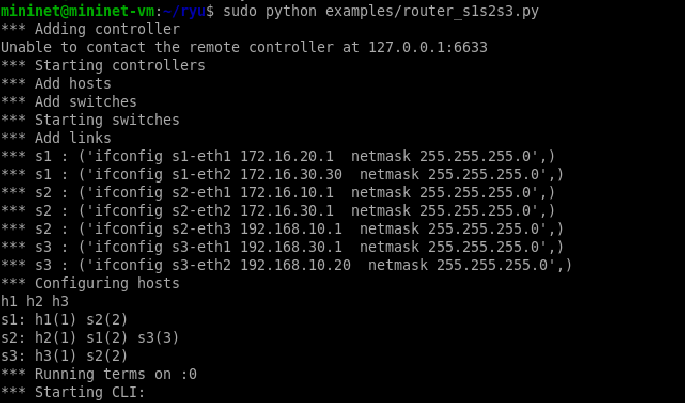{width="5.25in"
height="3.091848206474191in"}

Execução do script `examples_router_s1s2s3.py` no Mininet.

# 2 07.01 -- Teste de Conexões

Nesta etapa inicial, o objetivo foi verificar a conectividade geral
entre os hosts. Com a execução do comando `pingall`, foi possível
verificar a comunicação entre os nós da topologia.

## 2.1 `pingall`

O comando `pingall` testa a conectividade entre todos os hosts da rede
por meio de mensagens ICMP. Esse procedimento permite verificar se a
comunicação básica da topologia está funcionando corretamente.

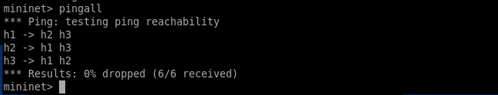{width="5.25in"
height="1.0093022747156606in"}

Execução do comando `pingall`.

# 3 07.02 -- Teste de Fluxo

Esta seção analisa como os pacotes trafegam entre os hosts e como as
regras de fluxo são instaladas durante a comunicação.

## 3.1 `h3 tcpdump -XX -n -i h3-eth0`

Foi utilizado o comando `tcpdump` para observar os pacotes recebidos
pela interface do host h3.

O objetivo é visualizar pacotes ARP, ICMP e outros tipos de tráfego,
permitindo analisar o comportamento da comunicação na rede.

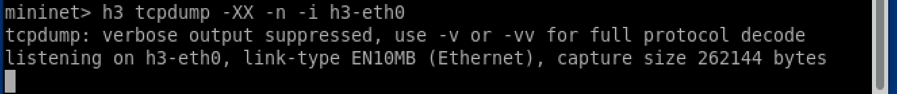{width="5.25in"
height="0.5542979002624672in"}

Captura de pacotes utilizando `tcpdump` no host h3.

## 3.2 `xterm h3 iperf --s`

O host h3 foi configurado como servidor *iperf*, ficando preparado para
receber tráfego TCP ou UDP de outros hosts.

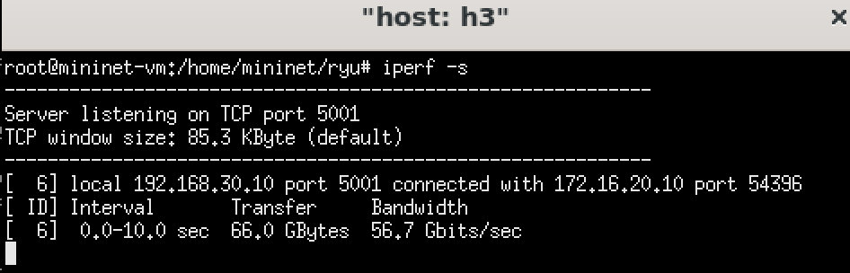{width="5.25in"
height="1.6871030183727034in"}

Servidor *iperf* executando no host h3.

## 3.3 `xterm h1: iperf -c`

O host h1 foi utilizado como cliente, enviando dados para o servidor
executado em h3. Esse teste permite observar a comunicação entre os
hosts e analisar o tráfego gerado pelo *iperf*.

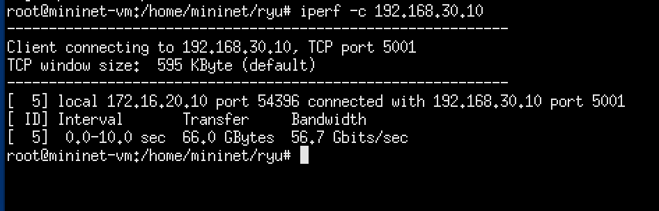{width="5.25in"
height="1.6871030183727034in"}

Cliente *iperf* no host h1 conectando-se ao servidor em h3.

# 4 07.03 -- Múltiplos Fluxos

O objetivo desta etapa é observar o comportamento do controlador Ryu
diante de diferentes tipos de tráfego ocorrendo na rede.

## 4.1 Fluxo UDP entre h1 e h2

Foi utilizado tráfego UDP com largura de banda configurada para 5 Mbps.
Esse teste permite observar o comportamento do tráfego UDP e analisar
aspectos relacionados à transmissão e à estabilidade da comunicação.

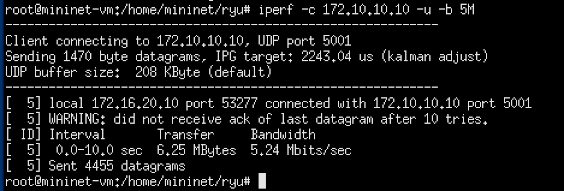{width="5.25in"
height="1.7798501749781277in"}

Fluxo UDP entre h1 e h2.

## 4.2 Fluxo TCP entre h1 e h3

O tráfego TCP foi utilizado para analisar a comunicação orientada à
conexão entre h1 e h3.

A observação desse fluxo permite analisar os pacotes utilizados no
estabelecimento e na manutenção da conexão, além das regras instaladas
para o encaminhamento dos dados.

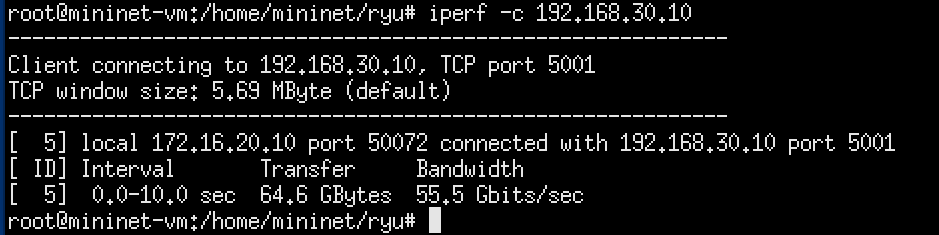{width="5.25in"
height="1.3138976377952756in"}

Fluxo TCP entre h1 e h3.

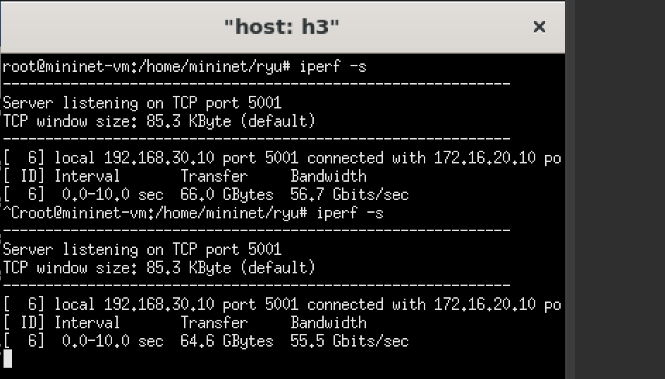{width="5.25in"
height="2.995227471566054in"}

Continuação da análise do fluxo TCP entre h1 e h3.

## 4.3 Fluxo HTTP entre h3 e h2

Neste teste, foi utilizado um servidor HTTP simples para simular uma
aplicação de rede. A comunicação permite observar a troca de requisições
e respostas HTTP entre os hosts.

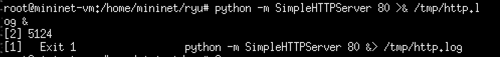{width="5.25in"
height="0.6015069991251094in"}

Fluxo HTTP entre h3 e h2.

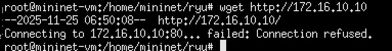{width="5.25in"
height="0.6853783902012248in"}

Continuação da análise do fluxo HTTP entre h3 e h2.

# 5 07.04 -- Análise dos Fluxos Instalados

Esta etapa investiga as regras OpenFlow instaladas durante os testes
anteriores.

## 5.1 `dpctl dump-flows`

O comando `dpctl dump-flows` permite visualizar as entradas presentes na
tabela de fluxos de um switch OpenFlow, incluindo informações como
prioridade, campos de correspondência, ações e contadores de pacotes e
bytes.

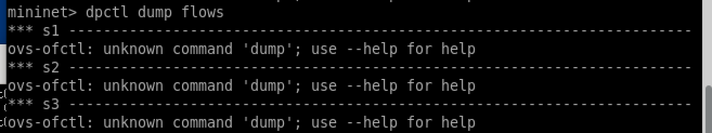{width="5.25in"
height="0.9828762029746282in"}

Regras de fluxo instaladas no switch.

## 5.2 Fluxo UDP h1 $\rightarrow$ h2

A análise dos contadores permite observar a quantidade de pacotes e
bytes associados ao fluxo UDP.

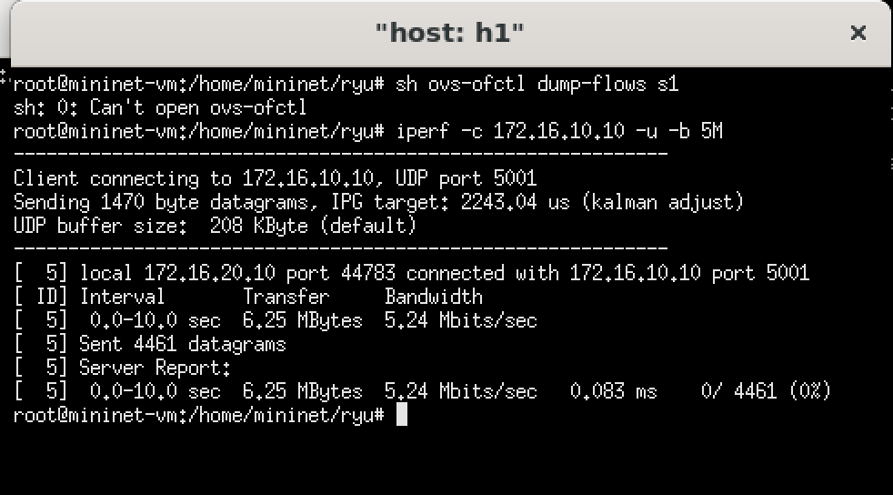{width="5.25in"
height="2.9083497375328085in"}

Fluxo UDP entre h1 e h2.

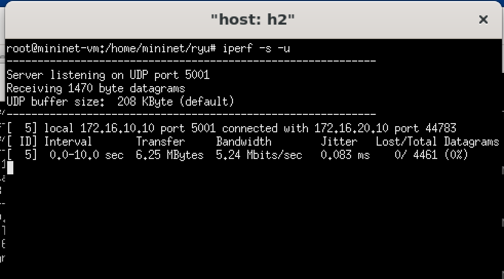{width="5.25in"
height="2.9083497375328085in"}

Continuação da análise do fluxo UDP.

## 5.3 Fluxo TCP h1 $\rightarrow$ h3

Os contadores de pacotes e bytes permitem analisar o tráfego TCP
observado durante o experimento.

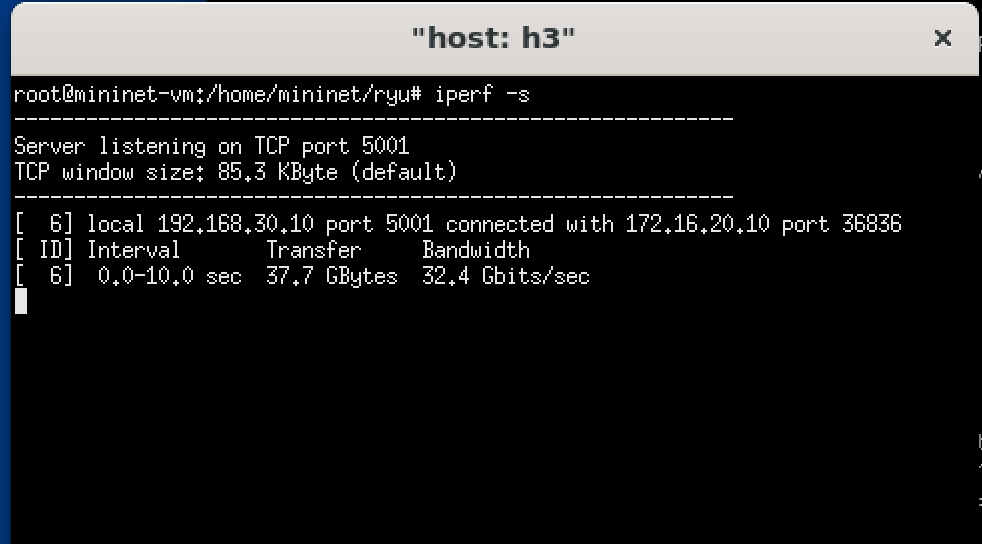{width="5.25in"
height="2.9083497375328085in"}

Fluxo TCP entre h1 e h3.

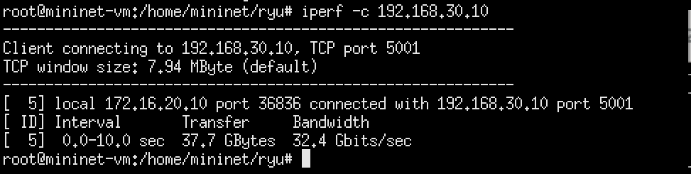{width="5.25in"
height="1.3219422572178479in"}

Continuação da análise do fluxo TCP.

# 6 07.05 -- Operações nos Elementos da Topologia

Nesta etapa foram realizados testes interativos diretamente nos switches
e hosts, permitindo observar informações relacionadas às interfaces,
tabelas ARP, rotas e portas.

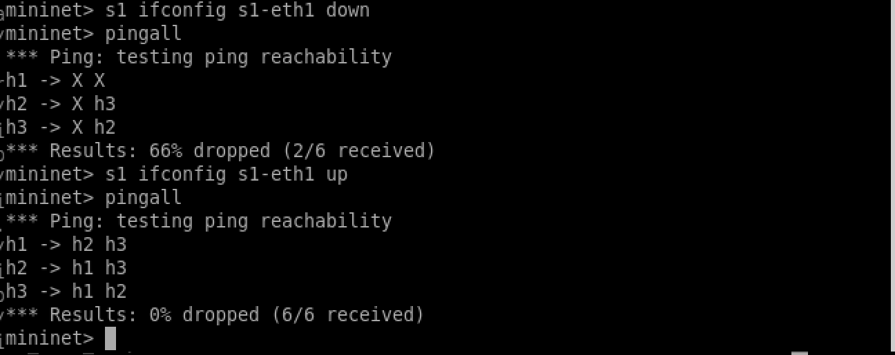{width="5.25in"
height="2.0862259405074366in"}

Operações realizadas nos elementos da topologia.

## 6.1 `xterm s2`

Foram executados comandos relacionados ao switch s2, incluindo
`ovs-vsctl show`, que permite visualizar informações sobre bridges,
portas e controladoras configuradas no Open vSwitch.

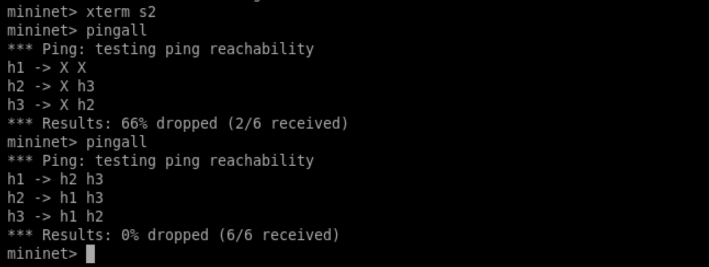{width="5.25in"
height="1.9814381014873141in"}

Informações do switch s2.

# 7 07.06 -- Router Ryu

Nesta etapa, a controladora Ryu foi utilizada com a aplicação
`rest_router`, permitindo configurar funções relacionadas ao roteamento
por meio de uma interface REST.

Essa abordagem possibilita configurar interfaces, endereços IP e rotas,
permitindo que a infraestrutura SDN realize o encaminhamento entre
diferentes redes.

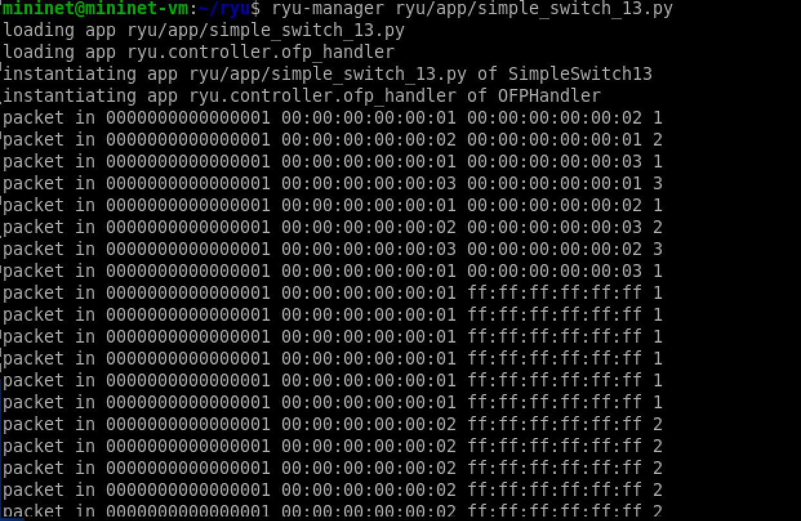{width="5.25in"
height="3.4196850393700786in"}

Execução do Ryu com a aplicação de roteamento REST.

# 8 07.07 -- Rotas de h1, h2 e h3

Nesta etapa foram analisadas as tabelas de roteamento dos hosts. A
análise permite verificar as rotas disponíveis e identificar a
configuração do gateway padrão.

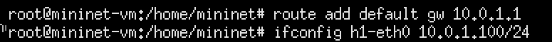{width="5.25in"
height="0.40645122484689417in"}

Tabela de roteamento do host h1.

# 9 07.08 -- Rotas de h2

Foi analisada a tabela de roteamento do host h2.

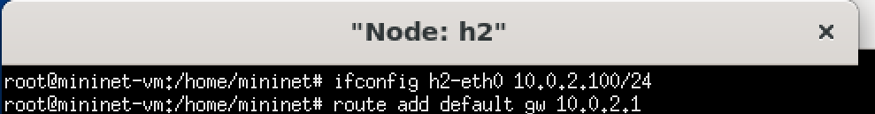{width="5.25in"
height="0.6847823709536308in"}

Tabela de roteamento do host h2.

# 10 07.09 -- Rotas de h3

Foi analisada a tabela de roteamento do host h3.

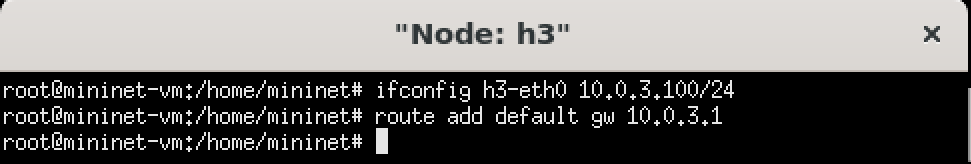{width="5.25in"
height="0.8867136920384951in"}

Tabela de roteamento do host h3.

# 11 07.10 -- `pingall`

Após a configuração das diferentes sub-redes e dos gateways, foi
realizado um novo teste de conectividade utilizando o comando `pingall`.

Esse teste permite verificar se os hosts conseguem se comunicar através
da infraestrutura de roteamento configurada.

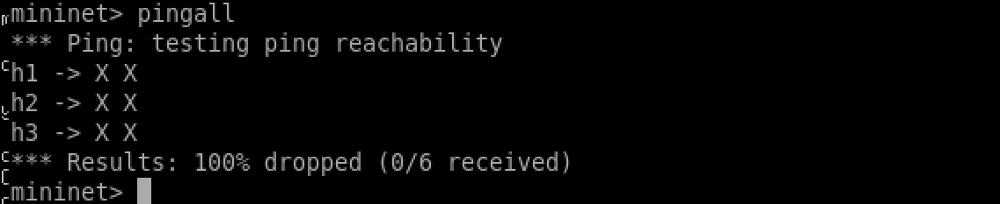{width="5.25in"
height="1.0758573928258968in"}

Resultado do `pingall` após a configuração do roteador.

# 12 07.11 -- REST Router

Nesta etapa foram utilizados comandos da API REST para configurar
interfaces e rotas no roteador.

Entre as operações realizadas estão:

-   adição de um endereço IP a uma porta do roteador;

-   configuração de rotas;

-   consulta das informações relacionadas ao roteamento.

Os comandos utilizados seguem a estrutura da API REST disponibilizada
pela aplicação `rest_router`.

# 13 07.12 -- Teste Final de Fluxo

Na etapa final foram utilizados *tcpdump* e *ping* para verificar o
fluxo dos pacotes através do roteador após a configuração das rotas.

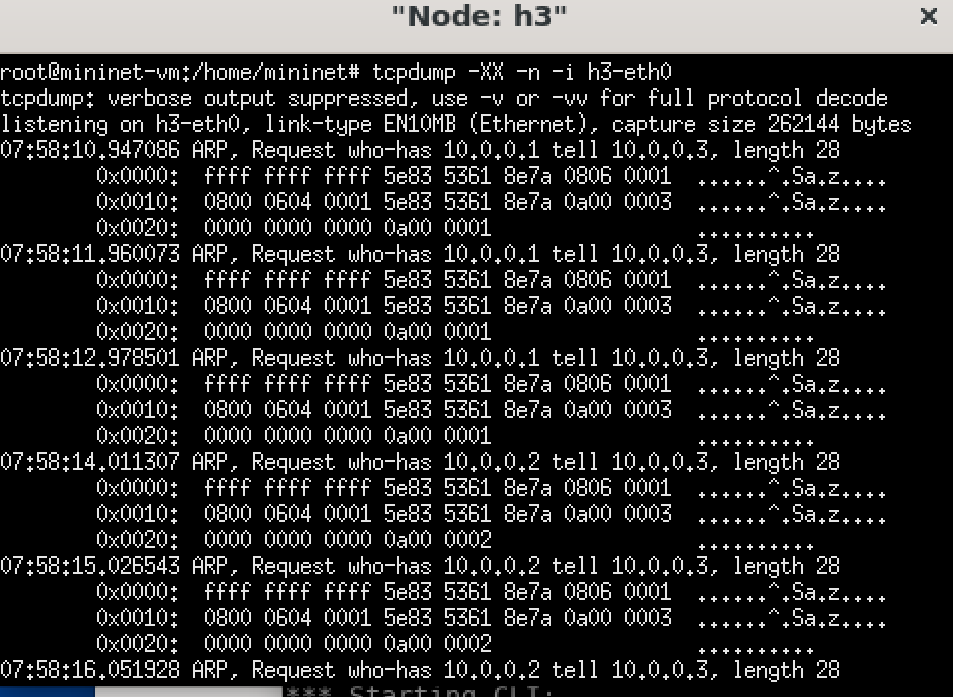{width="5.25in"
height="3.8397156605424323in"}

Captura final dos pacotes durante o teste de comunicação.

# 14 Conclusão

Os Experimentos 07 e 08 permitiram analisar, de forma prática, o
funcionamento do roteamento em uma rede definida por software utilizando
a controladora Ryu e o ambiente Mininet.

Durante os experimentos, foram realizados testes de conectividade,
análise de fluxos TCP, UDP e HTTP, captura de pacotes com *tcpdump*,
geração de tráfego com *iperf* e inspeção das regras instaladas nos
switches por meio do comando `dpctl dump-flows`.

A utilização da aplicação `rest_router` também permitiu estudar a
configuração de interfaces, endereços IP e rotas por meio de uma API
REST. A análise das tabelas de roteamento dos hosts e dos testes
realizados após a configuração possibilitou verificar o funcionamento do
encaminhamento entre diferentes redes.

Dessa forma, os experimentos contribuíram para a compreensão prática dos
conceitos de roteamento, encaminhamento de pacotes, tabelas de fluxo,
comunicação entre sub-redes e gerenciamento centralizado em ambientes
SDN.
