Abstract

Este relatório apresenta o Experimento 09, cujo objetivo é analisar o
funcionamento do módulo de firewall do controlador Ryu em um ambiente
SDN. A aplicação *ryu.app.rest_firewall* permite configurar regras de
filtragem por meio de uma API REST, controlando tráfego ICMP, TCP e HTTP
de maneira dinâmica. O experimento demonstra como adicionar, remover e
priorizar regras, bem como analisar o impacto nos fluxos reais da rede
utilizando ferramentas como *ping*, *wget*, *ssh* e servidores HTTP.

# 1 Introdução

O objetivo principal deste experimento é explorar o controle de tráfego
baseado em Software Defined Networking (SDN) utilizando o controlador
Ryu.

O firewall do Ryu permite adicionar regras que filtram pacotes
diretamente no plano de dados do switch OpenFlow. O experimento utiliza
o Mininet como ambiente de simulação, possibilitando executar testes
práticos para validar as políticas configuradas.

# 2 Inicialização da Topologia com `sudo mn`

Ao executar o comando `sudo mn`, o ambiente Mininet é iniciado, criando
hosts, o switch OVS e estabelecendo a comunicação com o controlador Ryu.
Esse ambiente é utilizado para validar o comportamento do firewall.

## 2.1 Configuração da Bridge OVS

A Figura [1](#fig:ovs_bridge) mostra o comando utilizado para configurar
a bridge e garantir a comunicação com o controlador.

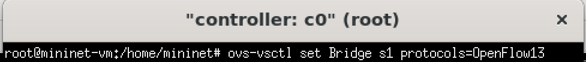{width="5.25in"
height="0.5588527996500438in"}

Execução do comando de configuração da bridge OVS.

## 2.2 Teste Inicial de Conectividade

Antes da instalação das regras, foi realizado um teste de *ping* entre
os hosts. Esse procedimento permite validar a conectividade inicial da
rede antes da aplicação das regras de firewall.

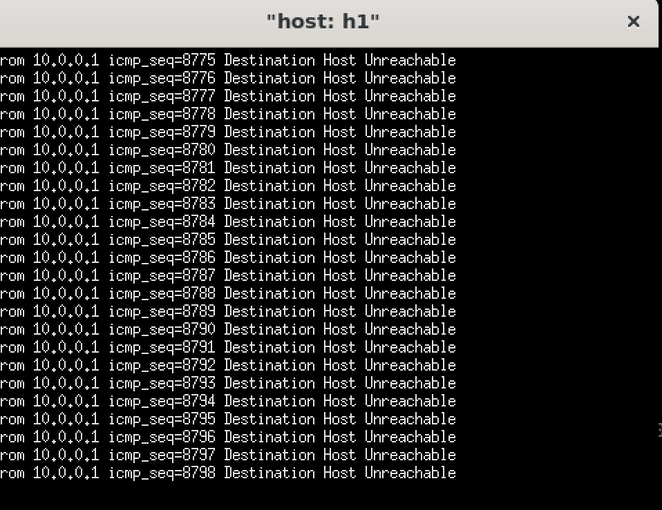{width="5.25in"
height="4.049842519685039in"}

Teste inicial de conectividade entre h1 e h2.

## 2.3 Habilitando o Firewall no Controlador via cURL

As figuras a seguir mostram a habilitação e a consulta do estado do
firewall utilizando requisições REST.

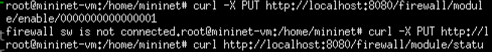{width="5.25in"
height="0.5588527996500438in"}

Habilitação do firewall utilizando uma requisição REST.

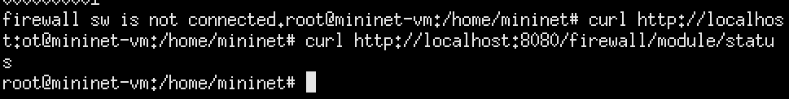{width="5.25in"
height="0.6609897200349957in"}

Consulta do estado do firewall utilizando uma requisição REST.

# 3 Adicionando Regras ICMP entre h1 e h2

É necessário inserir regras para permitir o tráfego ICMP entre os hosts
h1 e h2. Como as regras de filtragem são direcionais, são configuradas
regras para cada sentido da comunicação.

## 3.1 Regra de h1 para h2

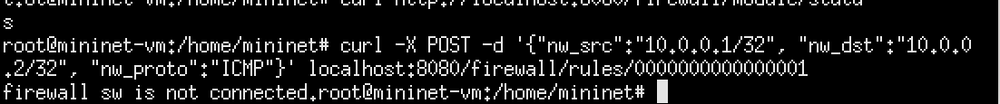{width="5.25in"
height="0.5478674540682414in"}

Regra ICMP de 10.0.0.1 para 10.0.0.2.

## 3.2 Regra de h2 para h1

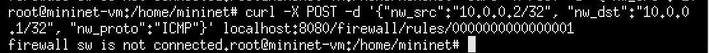{width="5.25in"
height="0.3965824584426947in"}

Regra ICMP de 10.0.0.2 para 10.0.0.1.

# 4 Adicionando Regras ICMP entre h2 e h3

Da mesma forma, a comunicação ICMP entre h2 e h3 requer regras
específicas para os dois sentidos da comunicação.

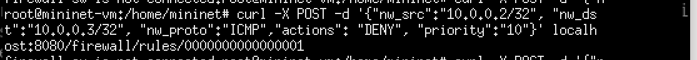{width="5.25in"
height="0.4614348206474191in"}

Regra ICMP de 10.0.0.2 para 10.0.0.3.

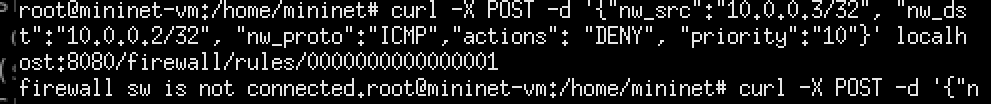{width="5.25in"
height="0.5509580052493438in"}

Regra ICMP de 10.0.0.3 para 10.0.0.2.

# 5 Adicionando Prioridades às Regras

Nesta etapa, são adicionadas regras com prioridade 10 e ação `DENY`. A
prioridade permite determinar a ordem de avaliação das regras quando
existem múltiplas regras aplicáveis ao mesmo fluxo.

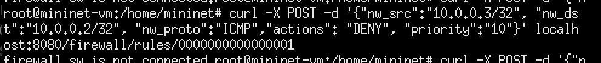{width="5.25in"
height="0.5509580052493438in"}

Regra de bloqueio ICMP entre h2 e h3 com prioridade.

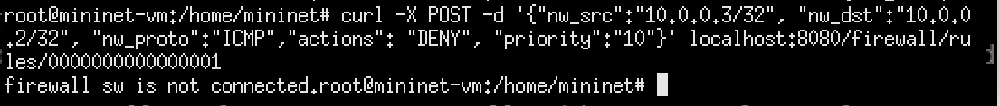{width="5.25in"
height="0.5606332020997375in"}

Regra de bloqueio ICMP entre h3 e h2 com prioridade.

# 6 Confirmando as Regras Instaladas

A figura abaixo apresenta a listagem das regras atualmente instaladas no
firewall.

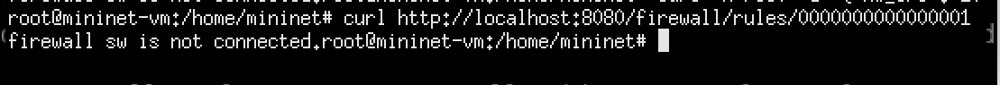{width="5.25in"
height="0.44972878390201226in"}

Listagem das regras instaladas no firewall.

# 7 Geração de Fluxos para Testes

Esta etapa tem como objetivo validar o efeito das regras configuradas
sobre o tráfego real da rede.

## 7.1 Novo Teste de Ping em h1

Foi realizado novamente um teste de *ping* para verificar o
comportamento da comunicação após a instalação das regras.

{width="5.25in"
height="4.049842519685039in"}

Teste de ping após a instalação das regras.

## 7.2 Ping em h3

Foi realizado um teste de comunicação de h3 para h2.

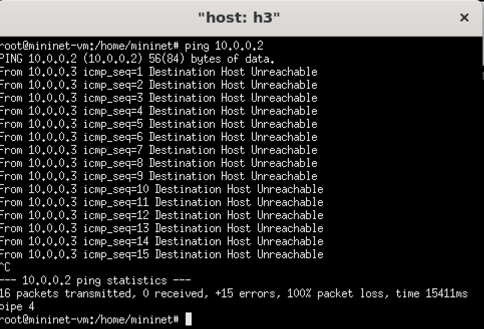{width="5.25in"
height="3.568911854768154in"}

Teste de ping de h3 para h2.

## 7.3 Servidor HTTP em h2

Um servidor HTTP foi executado no host h2 para permitir testes de
comunicação utilizando o protocolo HTTP.

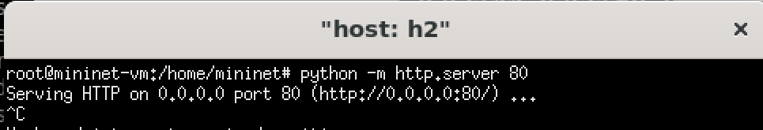{width="5.25in"
height="0.8976673228346457in"}

Servidor HTTP executando no host h2.

## 7.4 Wget em h1

O comando `wget` foi utilizado no host h1 para realizar uma requisição
HTTP ao servidor.

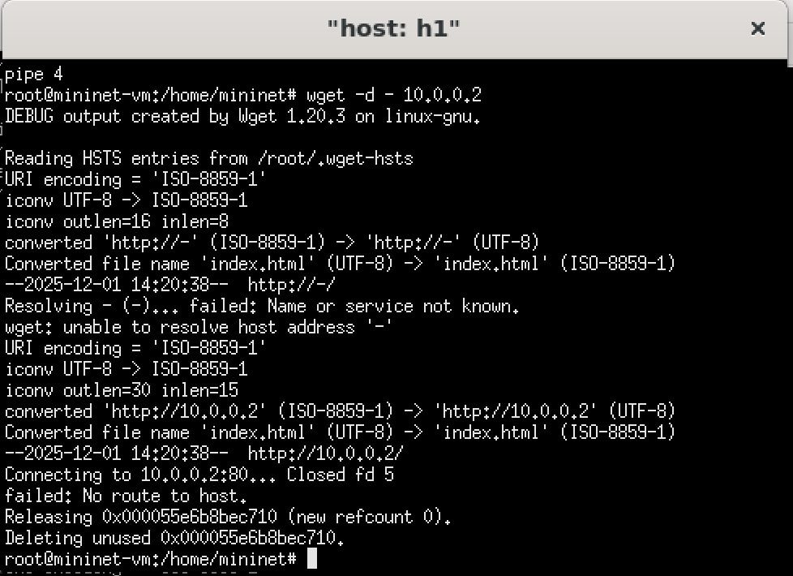{width="5.25in"
height="3.811349518810149in"}

Requisição HTTP utilizando `wget` em h1.

## 7.5 Wget em h3

Também foi realizada uma requisição HTTP utilizando `wget` no host h3.

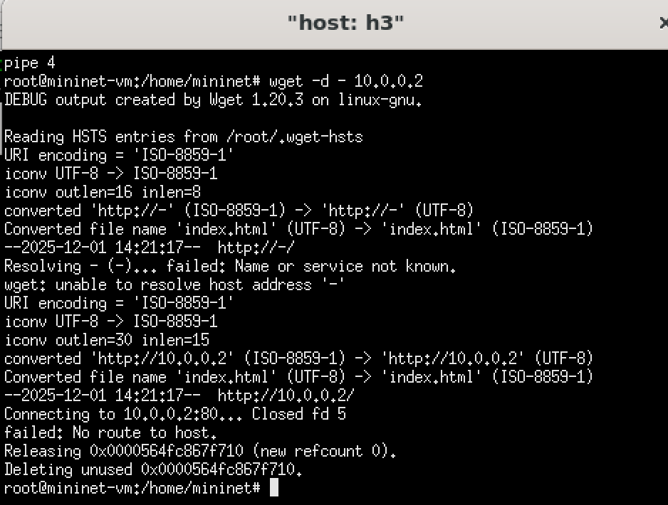{width="5.25in"
height="3.9738801399825023in"}

Requisição HTTP utilizando `wget` em h3.

## 7.6 SSH

Foi realizado um teste de conexão utilizando o protocolo SSH.

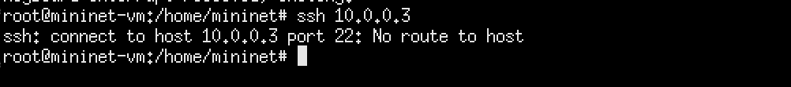{width="5.25in"
height="0.5815857392825897in"}

Teste de conexão utilizando SSH.

# 8 Remoção de Regras

A remoção das regras é realizada por meio da API REST. A alteração
possui efeito sobre os fluxos posteriormente processados pelo firewall.

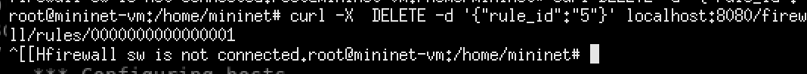{width="5.25in"
height="0.48665682414698164in"}

Remoção da regra 5.

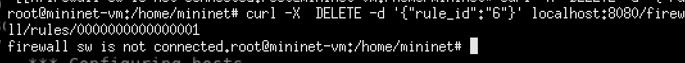{width="5.25in"
height="0.48665682414698164in"}

Remoção da regra 6.

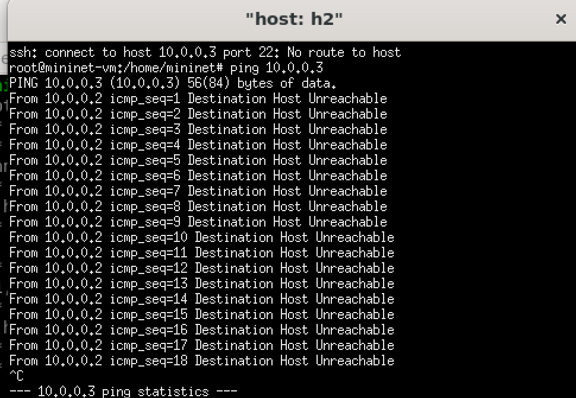{width="5.25in"
height="3.631700568678915in"}

Teste de ping após a remoção das regras.

# 9 Análise do Firewall SDN

O experimento demonstra que o firewall pode ser configurado de maneira
centralizada pelo controlador Ryu. As regras são utilizadas para
determinar quais tipos de tráfego podem ser encaminhados ou bloqueados
pelo switch OpenFlow.

A utilização de diferentes protocolos, como ICMP, HTTP e SSH, permite
observar como as regras de filtragem podem afetar diferentes tipos de
comunicação.

A definição de prioridades também permite estabelecer uma ordem de
avaliação das regras, sendo importante quando existem regras que podem
se aplicar ao mesmo tráfego.

Além disso, a utilização da API REST facilita a criação, consulta e
remoção das regras sem a necessidade de configurar individualmente cada
switch da rede.

# 10 Conclusão

O Experimento 09 demonstrou, de forma prática, o funcionamento de um
firewall SDN baseado no controlador Ryu.

A ativação do firewall, a adição de regras, a definição de prioridades e
a remoção dinâmica das regras permitiram observar diferentes mecanismos
de controle de tráfego em uma rede SDN.

Os testes realizados com tráfego ICMP, HTTP e SSH possibilitaram
verificar o efeito das regras sobre diferentes tipos de comunicação. A
utilização do Mininet e do switch Open vSwitch também permitiu observar
como as políticas configuradas no controlador influenciam diretamente o
encaminhamento dos pacotes.

Dessa forma, o experimento contribuiu para a compreensão dos conceitos
de filtragem de tráfego, regras OpenFlow, prioridades e gerenciamento
centralizado de políticas de segurança em Redes Definidas por Software.
