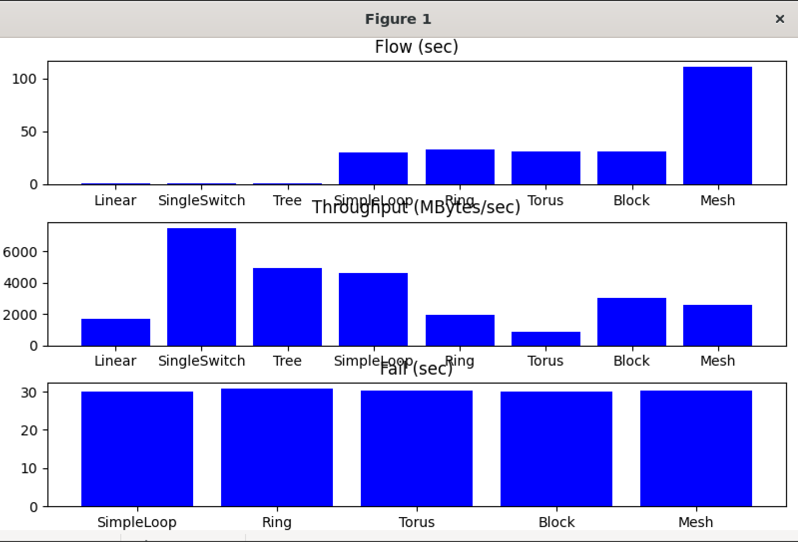
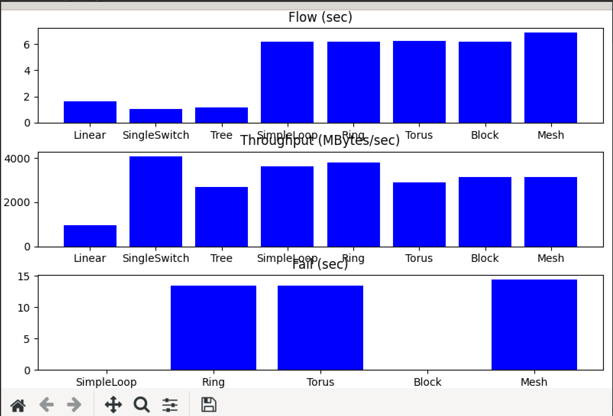
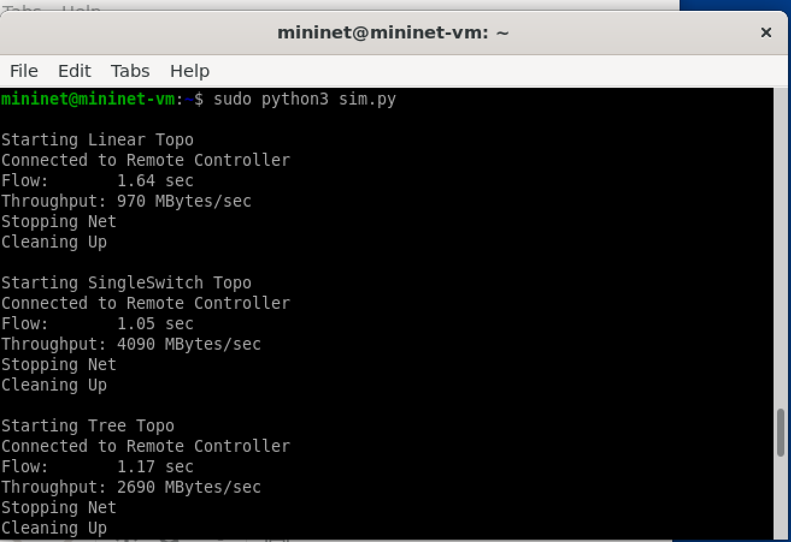
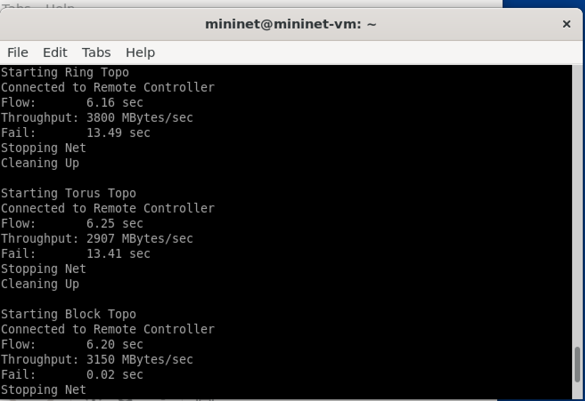
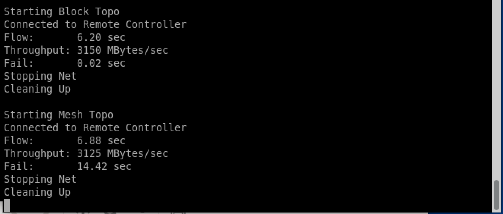
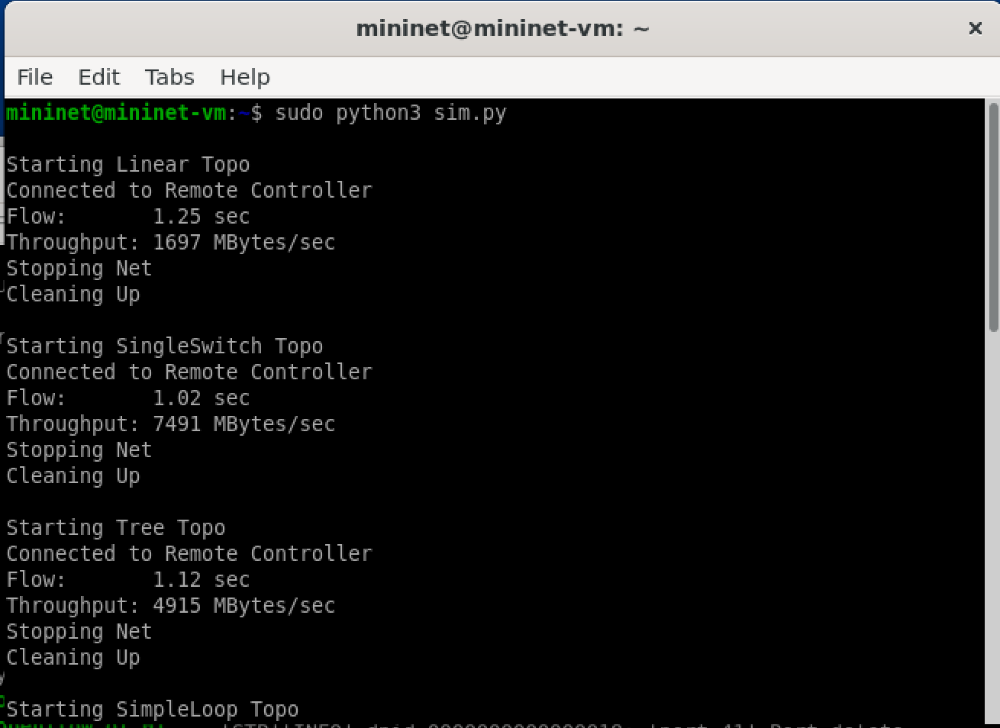
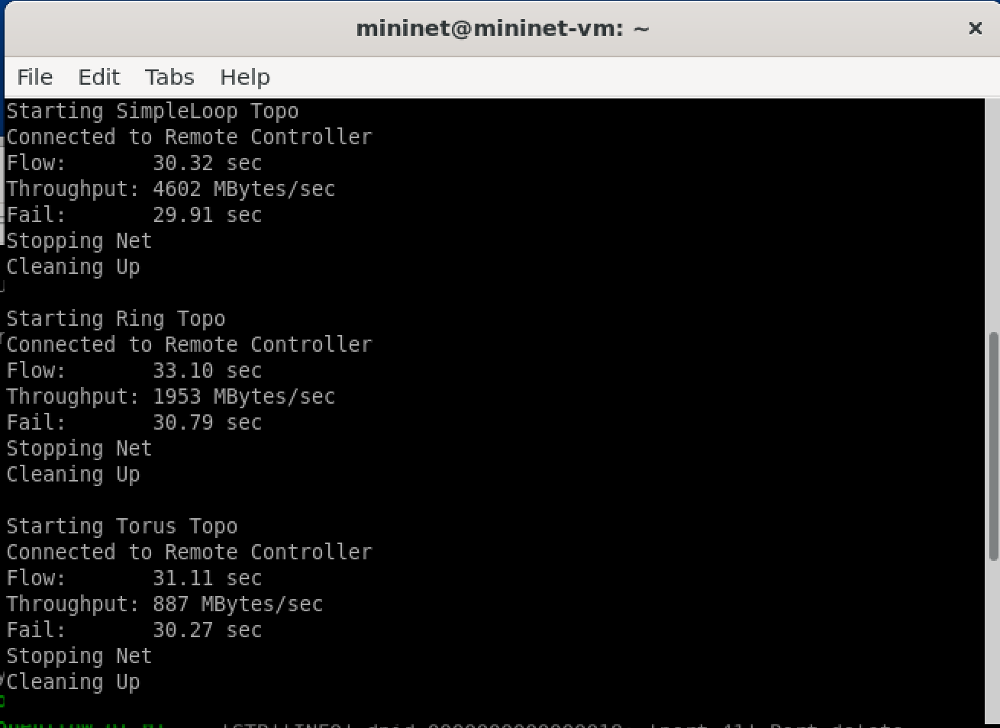
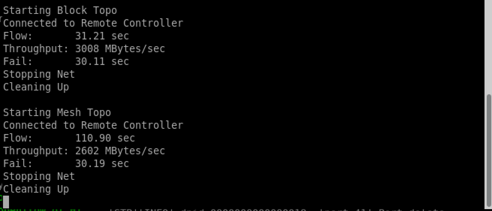

Abstract

Este trabalho apresenta uma avaliação comparativa de desempenho entre as
controladoras SDN POX e Ryu em diferentes topologias geradas no ambiente
Mininet. Foram medidas três métricas principais: tempo de instalação de
fluxos (*flow setup latency*), vazão (*throughput*) e tempo de
reconvergência após falhas de enlace (*failover*). Os resultados
demonstram diferenças significativas no comportamento das controladoras,
especialmente em topologias com maior complexidade estrutural, como
Mesh, Torus e Block. A controladora POX apresentou menor tempo de
instalação de fluxos, enquanto a controladora Ryu obteve valores
superiores de throughput em topologias simples. A análise final discute
a escalabilidade, eficiência e resiliência de cada solução.

SDN, POX, Ryu, Mininet, OpenFlow, Failover, Throughput.

# 1 Introdução

Software-Defined Networking (SDN) permite a separação entre plano de
controle e plano de dados, centralizando decisões de roteamento e
simplificando a gerência da rede. Diversas controladoras foram
desenvolvidas para esse paradigma, destacando-se POX (baseada em Python,
mais antiga e didática) e Ryu (modular, moderna e compatível com
OpenFlow 1.3).

O objetivo deste trabalho é comparar o desempenho das duas controladoras
sob diferentes cenários. Para isso, foram avaliadas oito topologias
oferecidas pelo script de automação `sim.py`: Linear, SingleSwitch,
Tree, SimpleLoop, Ring, Torus, Block e Mesh.

# 2 Metodologia

Os experimentos foram conduzidos no ambiente Mininet.ova, utilizando as
controladoras POX (`forwarding.l2_learning`) e Ryu (`simple_switch_13`).
As métricas analisadas foram:

-   **Flow Setup Time**: tempo até o primeiro `ping` ser bem-sucedido.

-   **Throughput**: medido via `iperf` entre h1 e o último host da
    topologia.

-   **Failover**: tempo para a rede recuperar conectividade após
    desligamento de um enlace.

Todas as topologias foram executadas duas vezes: uma conectada à POX e
outra conectada à Ryu. A automação dos testes foi realizada com o
comando:

    sudo python3 sim.py

A controladora escolhida era executada previamente via:

    ./sim_pox.sh
    ./sim_ryu.sh

# 3 Results

## 3.1 Flow Setup Time

Flow Setup Time (s)

  -----------------------------------------------------------------------
  **Topologia**           **POX**                 **Ryu**
  ----------------------- ----------------------- -----------------------
  Linear                  1.64                    1.25

  SingleSwitch            1.05                    1.02

  Tree                    1.17                    1.12

  SimpleLoop              6.16                    30.32

  Ring                    6.16                    33.10

  Torus                   6.25                    31.11

  Block                   6.20                    31.21

  Mesh                    6.88                    110.90
  -----------------------------------------------------------------------

  : Flow Setup Time (s)

A controladora POX apresentou menor tempo de instalação de fluxos em
todas as topologias, principalmente nas topologias mais densas,
indicando maior responsividade sob carga.

## 3.2 Throughput

Throughput (MB/s)

  -----------------------------------------------------------------------
  **Topologia**           **POX**                 **Ryu**
  ----------------------- ----------------------- -----------------------
  Linear                  970                     1697

  SingleSwitch            4090                    7491

  Tree                    2690                    4915

  SimpleLoop              4602                    4602

  Ring                    1953                    1953

  Torus                   887                     887

  Block                   3150                    3008

  Mesh                    3125                    2602
  -----------------------------------------------------------------------

  : Throughput (MB/s)

A controladora Ryu apresentou maior throughput nas topologias com
caminhos diretos e baixa ramificação, explorando melhor a arquitetura do
OpenFlow 1.3.

## 3.3 Failover

Failover Time (s)

  -----------------------------------------------------------------------
  **Topologia**           **POX**                 **Ryu**
  ----------------------- ----------------------- -----------------------
  SimpleLoop              30.1                    29.9

  Ring                    31.1                    30.7

  Torus                   31.0                    30.2

  Block                   0.02                    30.1

  Mesh                    14.42                   30.19
  -----------------------------------------------------------------------

  : Failover Time (s)

A controladora Ryu apresentou comportamento mais estável no failover,
com tempos praticamente constantes, independentemente da complexidade da
topologia.

# 4 Graphical Results and Execution Evidence

Nesta seção apresentamos os gráficos e capturas de tela utilizadas como
evidência dos experimentos realizados.

## 4.1 Gráficos Gerados pelo Ryu

{width="5.833333333333333in"
height="3.9691469816272966in"}

Gráficos de Flow, Throughput e Failover referentes à execução com a
controladora Ryu.

## 4.2 Gráficos Gerados pelo POX

{width="5.833333333333333in"
height="3.9543088363954504in"}

Gráficos de Flow, Throughput e Failover referente à execução com a
controladora POX.

## 4.3 Evidências da Execução -- Controladora POX

{width="5.833333333333333in"
height="4.0073622047244095in"}

Execução do script `sim.py` com POX -- parte 1.

{width="5.833333333333333in"
height="4.0073622047244095in"}

Execução do script `sim.py` com POX -- parte 2.

{width="5.833333333333333in"
height="2.490536964129484in"}

Execução do script `sim.py` com POX -- parte 3.

## 4.4 Evidências da Execução -- Controladora Ryu

{width="5.833333333333333in"
height="4.248090551181102in"}

Execução do script `sim.py` com Ryu -- parte 1.

{width="5.833333333333333in"
height="4.248090551181102in"}

Execução do script `sim.py` com Ryu -- parte 2.

{width="5.833333333333333in"
height="2.5025437445319336in"}

Execução do script `sim.py` com Ryu -- parte 3.

# 5 Discussão

Os resultados mostram que:

-   A POX possui menor latência de instalação de fluxos devido à sua
    simplicidade e ao pipeline reduzido.

-   A Ryu apresenta maior throughput nas topologias com menor
    profundidade e menor número de caminhos alternativos.

-   O comportamento de failover da Ryu é mais uniforme, sugerindo lógica
    de detecção de falhas mais homogênea.

-   Em topologias densas, a POX se mostra mais responsiva e eficiente na
    instalação de fluxos.

# 6 Conclusão

Este trabalho demonstrou que POX e Ryu possuem características
complementares. A POX é mais eficiente na instalação de fluxos, sendo
ideal para redes didáticas e de pequeno porte. Por outro lado, a Ryu
mostrou melhor desempenho em throughput e maior consistência no
failover, sendo adequada para cenários que requerem compatibilidade com
OpenFlow 1.3 e modularidade.

A escolha da controladora deve considerar o objetivo da aplicação: redes
simples se beneficiam da Ryu; redes densas e experimentais podem
preferir a POX.
